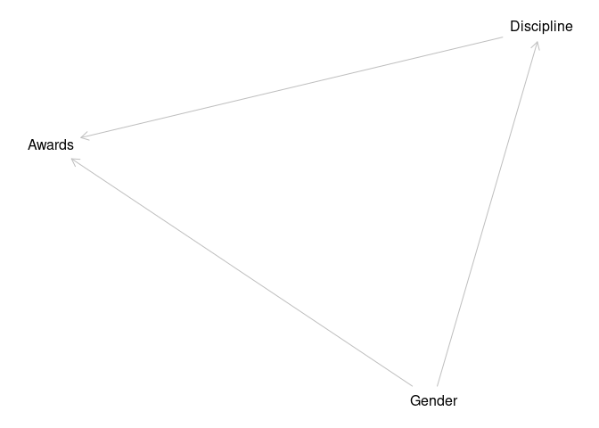
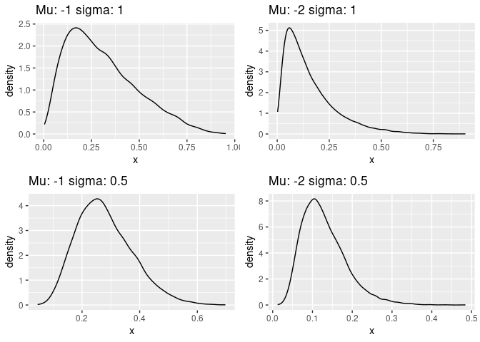
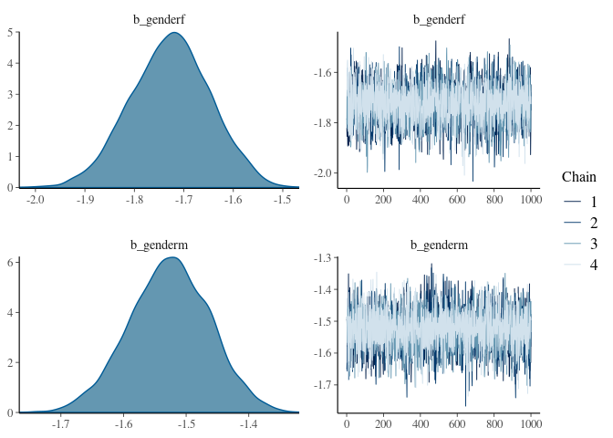
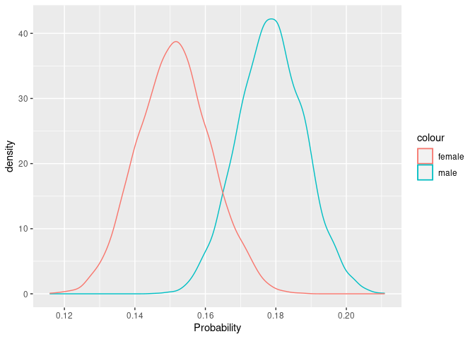
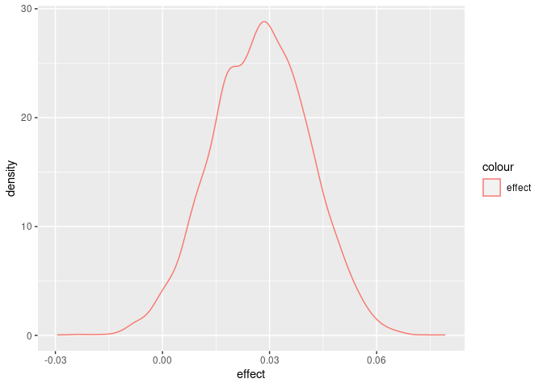
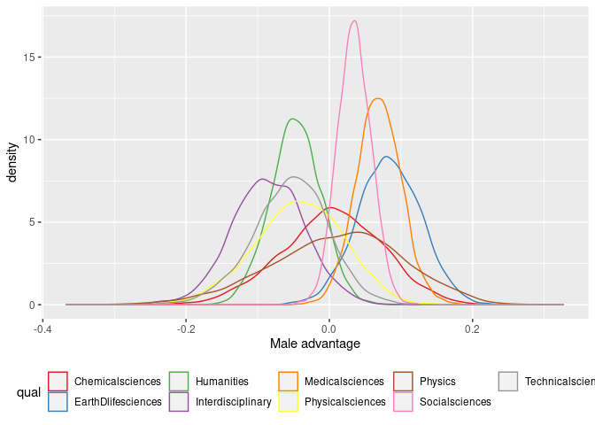
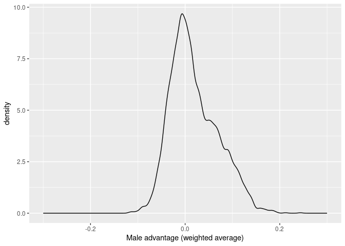

Week 5
================
Aurimas Racas
2023-02-12

## Exercise 1

The data in data(NWOGrants) are outcomes for scientific funding
applications for the Netherlands Organization for Scientific Research
(NWO) from 2010–2012 (see van der Lee and Ellemers
<doi:10.1073/pnas.1510159112>). These data have a structure similar to
the UCBAdmit data discussed in Chapter 11 and in lecture. There are
applications and each has an associated gender (of the lead researcher).
But instead of departments, there are disciplines. Draw a DAG for this
sample. Then use the backdoor criterion and a binomial GLM to estimate
the TOTAL causal effect of gender on grant awards.

``` r
dag = dagitty("dag {
  Gender -> Awards;
  Gender -> Discipline;
  Discipline -> Awards;
}", layout = T)

outcomes(dag) = "Awards"
exposures(dag) = "Gender"

plot(dag)
```

<!-- -->

To estimate a total causal effect, we do not need to control for
anything.

Let’s think about priors. Awards are rare - presumably, 10-20% of
applications. How to get that? It must be drawn from normal distribution
with negative mean. Let’s try a couple of examples.

``` r
pos_values = list(
  c("m"=-1, "s"=1),
  c("m"=-2, "s"=1),
  c("m"=-1, "s"=0.5),
  c("m"=-2, "s"=0.5)
)

plots = lapply(pos_values, function(vals) {
  inv_logit(rnorm(10000, vals['m'], vals['s'])) |> 
    as_tibble_col("x") |> 
    ggplot() + geom_density(aes(x=x)) + 
    ggtitle(paste("Mu:", vals['m'], "sigma:", vals['s']))
})

grid.arrange(grobs=plots)
```

<!-- --> To be on the
safe side, I’ll go with a semi-informative prior: N(-1, 0.5).

    ## Running /usr/lib/R/bin/R CMD SHLIB foo.c
    ## gcc -I"/usr/share/R/include" -DNDEBUG   -I"/home/aurimas/R/x86_64-pc-linux-gnu-library/4.2/Rcpp/include/"  -I"/home/aurimas/R/x86_64-pc-linux-gnu-library/4.2/RcppEigen/include/"  -I"/home/aurimas/R/x86_64-pc-linux-gnu-library/4.2/RcppEigen/include/unsupported"  -I"/home/aurimas/R/x86_64-pc-linux-gnu-library/4.2/BH/include" -I"/home/aurimas/R/x86_64-pc-linux-gnu-library/4.2/StanHeaders/include/src/"  -I"/home/aurimas/R/x86_64-pc-linux-gnu-library/4.2/StanHeaders/include/"  -I"/home/aurimas/R/x86_64-pc-linux-gnu-library/4.2/RcppParallel/include/"  -I"/home/aurimas/R/x86_64-pc-linux-gnu-library/4.2/rstan/include" -DEIGEN_NO_DEBUG  -DBOOST_DISABLE_ASSERTS  -DBOOST_PENDING_INTEGER_LOG2_HPP  -DSTAN_THREADS  -DBOOST_NO_AUTO_PTR  -include '/home/aurimas/R/x86_64-pc-linux-gnu-library/4.2/StanHeaders/include/stan/math/prim/mat/fun/Eigen.hpp'  -D_REENTRANT -DRCPP_PARALLEL_USE_TBB=1      -fpic  -g -O2 -fdebug-prefix-map=/build/r-base-a3XuZ5/r-base-4.2.2.20221110=. -fstack-protector-strong -Wformat -Werror=format-security -Wdate-time -D_FORTIFY_SOURCE=2  -c foo.c -o foo.o
    ## In file included from /home/aurimas/R/x86_64-pc-linux-gnu-library/4.2/RcppEigen/include/Eigen/Core:88,
    ##                  from /home/aurimas/R/x86_64-pc-linux-gnu-library/4.2/RcppEigen/include/Eigen/Dense:1,
    ##                  from /home/aurimas/R/x86_64-pc-linux-gnu-library/4.2/StanHeaders/include/stan/math/prim/mat/fun/Eigen.hpp:13,
    ##                  from <command-line>:
    ## /home/aurimas/R/x86_64-pc-linux-gnu-library/4.2/RcppEigen/include/Eigen/src/Core/util/Macros.h:628:1: error: unknown type name ‘namespace’
    ##   628 | namespace Eigen {
    ##       | ^~~~~~~~~
    ## /home/aurimas/R/x86_64-pc-linux-gnu-library/4.2/RcppEigen/include/Eigen/src/Core/util/Macros.h:628:17: error: expected ‘=’, ‘,’, ‘;’, ‘asm’ or ‘__attribute__’ before ‘{’ token
    ##   628 | namespace Eigen {
    ##       |                 ^
    ## In file included from /home/aurimas/R/x86_64-pc-linux-gnu-library/4.2/RcppEigen/include/Eigen/Dense:1,
    ##                  from /home/aurimas/R/x86_64-pc-linux-gnu-library/4.2/StanHeaders/include/stan/math/prim/mat/fun/Eigen.hpp:13,
    ##                  from <command-line>:
    ## /home/aurimas/R/x86_64-pc-linux-gnu-library/4.2/RcppEigen/include/Eigen/Core:96:10: fatal error: complex: No such file or directory
    ##    96 | #include <complex>
    ##       |          ^~~~~~~~~
    ## compilation terminated.
    ## make: *** [/usr/lib/R/etc/Makeconf:169: foo.o] Error 1

``` r
summary(ex1_model)
```

    ##  Family: binomial 
    ##   Links: mu = logit 
    ## Formula: awards | trials(applications) ~ 0 + gender 
    ##    Data: NWOGrants (Number of observations: 18) 
    ##   Draws: 4 chains, each with iter = 2000; warmup = 1000; thin = 1;
    ##          total post-warmup draws = 4000
    ## 
    ## Population-Level Effects: 
    ##         Estimate Est.Error l-95% CI u-95% CI Rhat Bulk_ESS Tail_ESS
    ## genderf    -1.73      0.08    -1.89    -1.57 1.00     4015     2747
    ## genderm    -1.53      0.06    -1.66    -1.40 1.00     3736     2844
    ## 
    ## Draws were sampled using sampling(NUTS). For each parameter, Bulk_ESS
    ## and Tail_ESS are effective sample size measures, and Rhat is the potential
    ## scale reduction factor on split chains (at convergence, Rhat = 1).

``` r
plot(ex1_model)
```

<!-- --> What is the
causal effect? Looks like Men have c. 3% higher probability, on average,
to get an award.

``` r
as_draws_df(ex1_model, variable=c('b_genderf', 'b_genderm')) |>
  ggplot() +
  geom_density(aes(x=inv_logit(b_genderm),  color='male')) +
  geom_density(aes(x=inv_logit(b_genderf), color='female')) +
  xlab("Probability")
```

<!-- -->

``` r
as_draws_df(ex1_model, variable=c('b_genderf', 'b_genderm')) |>
  mutate(effect = inv_logit(b_genderm) - inv_logit(b_genderf)) |> ggplot() +
  geom_density(aes(x=effect, color='effect'))
```

<!-- --> \## Exercise
2

Now estimate the DIRECT causal effect of gender on grant awards. Use the
same DAG as above to justify one or more binomial models. Compute the
average direct causal effect of gender, weighting each discipline in
proportion to the number of applications in the sample. Refer to the
marginal effect example in Lecture 9 for help.

We need to condition on discipline to get direct effects.

    ## Running /usr/lib/R/bin/R CMD SHLIB foo.c
    ## gcc -I"/usr/share/R/include" -DNDEBUG   -I"/home/aurimas/R/x86_64-pc-linux-gnu-library/4.2/Rcpp/include/"  -I"/home/aurimas/R/x86_64-pc-linux-gnu-library/4.2/RcppEigen/include/"  -I"/home/aurimas/R/x86_64-pc-linux-gnu-library/4.2/RcppEigen/include/unsupported"  -I"/home/aurimas/R/x86_64-pc-linux-gnu-library/4.2/BH/include" -I"/home/aurimas/R/x86_64-pc-linux-gnu-library/4.2/StanHeaders/include/src/"  -I"/home/aurimas/R/x86_64-pc-linux-gnu-library/4.2/StanHeaders/include/"  -I"/home/aurimas/R/x86_64-pc-linux-gnu-library/4.2/RcppParallel/include/"  -I"/home/aurimas/R/x86_64-pc-linux-gnu-library/4.2/rstan/include" -DEIGEN_NO_DEBUG  -DBOOST_DISABLE_ASSERTS  -DBOOST_PENDING_INTEGER_LOG2_HPP  -DSTAN_THREADS  -DBOOST_NO_AUTO_PTR  -include '/home/aurimas/R/x86_64-pc-linux-gnu-library/4.2/StanHeaders/include/stan/math/prim/mat/fun/Eigen.hpp'  -D_REENTRANT -DRCPP_PARALLEL_USE_TBB=1      -fpic  -g -O2 -fdebug-prefix-map=/build/r-base-a3XuZ5/r-base-4.2.2.20221110=. -fstack-protector-strong -Wformat -Werror=format-security -Wdate-time -D_FORTIFY_SOURCE=2  -c foo.c -o foo.o
    ## In file included from /home/aurimas/R/x86_64-pc-linux-gnu-library/4.2/RcppEigen/include/Eigen/Core:88,
    ##                  from /home/aurimas/R/x86_64-pc-linux-gnu-library/4.2/RcppEigen/include/Eigen/Dense:1,
    ##                  from /home/aurimas/R/x86_64-pc-linux-gnu-library/4.2/StanHeaders/include/stan/math/prim/mat/fun/Eigen.hpp:13,
    ##                  from <command-line>:
    ## /home/aurimas/R/x86_64-pc-linux-gnu-library/4.2/RcppEigen/include/Eigen/src/Core/util/Macros.h:628:1: error: unknown type name ‘namespace’
    ##   628 | namespace Eigen {
    ##       | ^~~~~~~~~
    ## /home/aurimas/R/x86_64-pc-linux-gnu-library/4.2/RcppEigen/include/Eigen/src/Core/util/Macros.h:628:17: error: expected ‘=’, ‘,’, ‘;’, ‘asm’ or ‘__attribute__’ before ‘{’ token
    ##   628 | namespace Eigen {
    ##       |                 ^
    ## In file included from /home/aurimas/R/x86_64-pc-linux-gnu-library/4.2/RcppEigen/include/Eigen/Dense:1,
    ##                  from /home/aurimas/R/x86_64-pc-linux-gnu-library/4.2/StanHeaders/include/stan/math/prim/mat/fun/Eigen.hpp:13,
    ##                  from <command-line>:
    ## /home/aurimas/R/x86_64-pc-linux-gnu-library/4.2/RcppEigen/include/Eigen/Core:96:10: fatal error: complex: No such file or directory
    ##    96 | #include <complex>
    ##       |          ^~~~~~~~~
    ## compilation terminated.
    ## make: *** [/usr/lib/R/etc/Makeconf:169: foo.o] Error 1

``` r
summary(ex2_model)
```

    ##  Family: binomial 
    ##   Links: mu = logit 
    ## Formula: awards | trials(applications) ~ 0 + gender:discipline 
    ##    Data: NWOGrants (Number of observations: 18) 
    ##   Draws: 4 chains, each with iter = 2000; warmup = 1000; thin = 1;
    ##          total post-warmup draws = 4000
    ## 
    ## Population-Level Effects: 
    ##                                      Estimate Est.Error l-95% CI u-95% CI Rhat
    ## genderf:disciplineChemicalsciences      -1.05      0.29    -1.65    -0.49 1.00
    ## genderm:disciplineChemicalsciences      -1.03      0.23    -1.48    -0.59 1.00
    ## genderf:disciplineEarthDlifesciences    -1.65      0.22    -2.11    -1.23 1.00
    ## genderm:disciplineEarthDlifesciences    -1.12      0.18    -1.48    -0.79 1.00
    ## genderf:disciplineHumanities            -1.38      0.18    -1.74    -1.05 1.00
    ## genderm:disciplineHumanities            -1.70      0.17    -2.06    -1.37 1.00
    ## genderf:disciplineInterdisciplinary     -1.22      0.24    -1.70    -0.77 1.00
    ## genderm:disciplineInterdisciplinary     -1.80      0.25    -2.29    -1.33 1.00
    ## genderf:disciplineMedicalsciences       -1.95      0.18    -2.32    -1.61 1.00
    ## genderm:disciplineMedicalsciences       -1.43      0.15    -1.73    -1.13 1.00
    ## genderf:disciplinePhysicalsciences      -1.14      0.29    -1.71    -0.58 1.00
    ## genderm:disciplinePhysicalsciences      -1.38      0.20    -1.79    -0.99 1.00
    ## genderf:disciplinePhysics               -1.09      0.42    -1.93    -0.26 1.00
    ## genderm:disciplinePhysics               -1.01      0.25    -1.51    -0.54 1.00
    ## genderf:disciplineSocialsciences        -1.96      0.14    -2.25    -1.68 1.00
    ## genderm:disciplineSocialsciences        -1.67      0.13    -1.92    -1.41 1.00
    ## genderf:disciplineTechnicalsciences     -1.25      0.27    -1.80    -0.73 1.00
    ## genderm:disciplineTechnicalsciences     -1.59      0.18    -1.96    -1.24 1.00
    ##                                      Bulk_ESS Tail_ESS
    ## genderf:disciplineChemicalsciences       7887     2934
    ## genderm:disciplineChemicalsciences      11109     3076
    ## genderf:disciplineEarthDlifesciences     8865     2618
    ## genderm:disciplineEarthDlifesciences    10053     2916
    ## genderf:disciplineHumanities             8014     2992
    ## genderm:disciplineHumanities            10330     2875
    ## genderf:disciplineInterdisciplinary      8893     3131
    ## genderm:disciplineInterdisciplinary      9272     2781
    ## genderf:disciplineMedicalsciences        8157     2679
    ## genderm:disciplineMedicalsciences       10557     2799
    ## genderf:disciplinePhysicalsciences       9358     2931
    ## genderm:disciplinePhysicalsciences       9798     2877
    ## genderf:disciplinePhysics               10002     2918
    ## genderm:disciplinePhysics               12287     3009
    ## genderf:disciplineSocialsciences         9611     2719
    ## genderm:disciplineSocialsciences         9938     3243
    ## genderf:disciplineTechnicalsciences     10536     2651
    ## genderm:disciplineTechnicalsciences      9168     2521
    ## 
    ## Draws were sampled using sampling(NUTS). For each parameter, Bulk_ESS
    ## and Tail_ESS are effective sample size measures, and Rhat is the potential
    ## scale reduction factor on split chains (at convergence, Rhat = 1).

First, let’s display results by discipline.

``` r
clean_results = as_draws_df(ex2_model) |> 
  pivot_longer(everything()) |>
  mutate(tmp = str_split_fixed(name, fixed(":"), 2)) |>
  mutate(gender = str_remove(tmp[,1], "b_gender")) |>
  mutate(discipline = str_remove(tmp[,2], "discipline")) |>
  select(gender, discipline, value) |>
  pivot_wider(discipline, names_from= gender, values_from=value, values_fn=list) |>
  select(discipline, f, m) |>
  filter(discipline != "") |> 
  unnest(cols=c(f, m)) |> 
  mutate(effect = inv_logit(m) - inv_logit(f))


ggplot(clean_results) + 
  geom_density(aes(x=effect, color=discipline)) + xlab("Male advantage") +
  theme(legend.position = "bottom") +
  scale_color_brewer("qual", palette = "Set1")
```

<!-- --> Now, to
display the “weighted average” effect, we will need to simulate.

``` r
by_disc = NWOGrants |> 
  group_by(discipline) |> summarize(applications = sum(applications))


all_male = by_disc |> mutate(gender = 'm')
all_female = by_disc |> mutate(gender = 'f')


male_predictions = predict(
  ex2_model, 
  newdata=all_male, 
  summary=F
)

female_predictions = predict(
  ex2_model, 
  newdata=all_female, 
  summary=F
)

male_award_rate = apply(male_predictions / by_disc$applications, 1, mean)

female_award_rate = apply(female_predictions / by_disc$applications, 1, mean)

(male_award_rate - female_award_rate) |>
  as_tibble_col("x") |>
  ggplot() + geom_density(aes(x=x), bw=0.005) + 
  xlab("Male advantage (weighted average)") +
  xlim(-0.3,0.3)
```

<!-- --> The direct
effect appears to be smaller than the overall effect, and just somewhat
above zero. As a result, it may be that less awards granted to females
are due to structural differences in the fields they work in rather than
direct discrimination in award process.

``` r
options("marginaleffects_posterior_interval" = "hdi")

comparisons(
  ex2_model, variables="gender", type='link', 
  by='discipline', 
  transform_pre = function (hi, lo) inv_logit(hi) - inv_logit(lo)
)
```

    ## 
    ##    Term Contrast          discipline  Estimate     2.5 %  97.5 %
    ##  gender   custom   Chemical sciences  0.005179 -0.132829 0.14048
    ##  gender   custom Earth/life sciences  0.082795 -0.001481 0.16908
    ##  gender   custom          Humanities -0.046871 -0.116933 0.02126
    ##  gender   custom   Interdisciplinary -0.085182 -0.182329 0.01493
    ##  gender   custom    Medical sciences  0.069128  0.008372 0.13156
    ##  gender   custom   Physical sciences -0.041059 -0.166402 0.07434
    ##  gender   custom             Physics  0.016489 -0.168509 0.18822
    ##  gender   custom     Social sciences  0.034848 -0.010246 0.07960
    ##  gender   custom  Technical sciences -0.052291 -0.158063 0.05040
    ## 
    ## Prediction type:  link 
    ## Columns: type, term, contrast, discipline, estimate, conf.low, conf.high

``` r
comparisons(
  ex2_model, variables="gender", type='link', 
  by=T, 
  transform_pre = function (hi, lo) inv_logit(hi) - inv_logit(lo)
)
```

    ## 
    ##    Term Contrast  Estimate    2.5 %  97.5 %
    ##  gender   custom -0.002336 -0.03936 0.03122
    ## 
    ## Prediction type:  link 
    ## Columns: type, term, contrast, estimate, conf.low, conf.high
