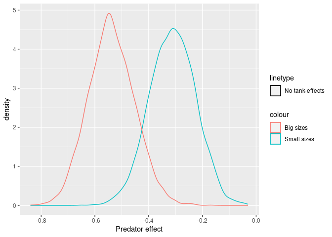
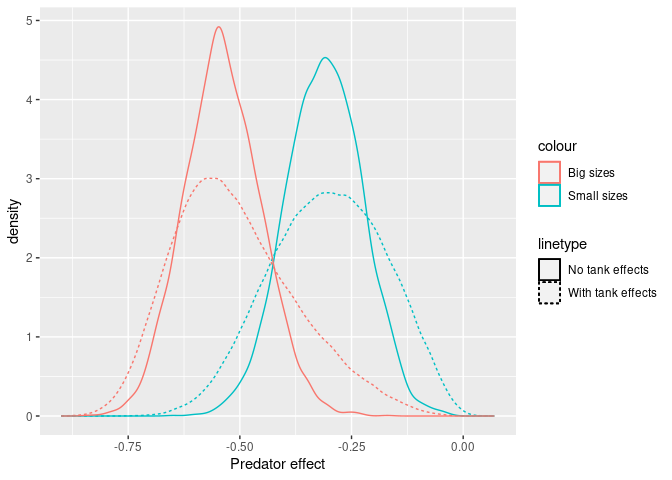
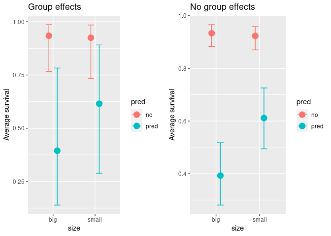
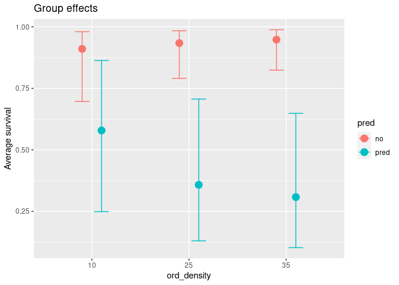
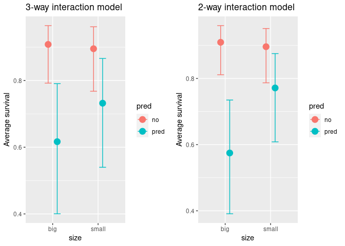

Week 6 HW
================

``` r
knitr::opts_chunk$set(warning = FALSE, message = FALSE, error=FALSE) 
library(tidyverse)
library(ggplot2)
library(gridExtra)
library(RColorBrewer)
library(rethinking)
library(scales)
library(dagitty)
library(brms)
library(tidybayes)
library(marginaleffects)

data("reedfrogs")
```

# Ex 1

Conduct a prior predictive simulation for the Reedfrog model. By this I
mean to simulate the prior distribution of tank survival probabilities
$\alpha_j$. Start by using this prior: \$\$
\$\$ Be sure to transform the $\alpha_j$ values to the probability scale
for plotting and summary. How does increasing the width of the prior on
$\sigma$ change the prior distribution of $\alpha_j$? You might try
Exponential(10) and Exponential(0.1) for example.

``` r
N = 100000
sigmas_to_try = round(exp(seq(from=-log(10), to=log(10), by=0.4)),2) #a range of sigma values

#simulate 10k observations of a_j for each sigma
aj_matrix = sapply(sigmas_to_try, function (exp_rate) {
  sigma = rexp(N, exp_rate)
  a_bar = rnorm(N, 0, 1)
  a_j = rnorm(N, a_bar, sigma)  
  a_j
})

colnames(aj_matrix) = sigmas_to_try

aj_matrix |> 
  as_tibble() |> 
  pivot_longer(everything(), names_to = "sigma", values_to = "a_j") |>
  mutate(p = inv_logit(a_j)) |>
  mutate(sigma = paste("σ =", sigma)) |>
  ggplot() + geom_density(aes(x=p)) + 
  facet_wrap(~sigma, nrow=2) + theme_bw() + 
  theme(legend.position = "none") +
  scale_x_continuous(breaks=c(0,0.5, 1))
```

<!-- -->

# Ex 2

Revisit the Reedfrog survival data, data(reedfrogs). Start with the
varying effects model from the book and lecture. Then modify it to
estimate the causal effects of the treatment variables pred and size,
including how size might modify the effect of predation. An easy
approach is to estimate an effect for each combination of pred and size.
Justify your model with a DAG of this experiment.

``` r
dag = dagitty("dag {
    Size -> Survival;
    Predators -> Survival;
    Density -> Survival;
    Tank -> Survival;
}", layout=T)

outcomes(dag) = "Survival"
exposures(dag) = c("Predators", "Size")

plot(dag)
```

<!-- -->

First, replicate the lecture model in BRMS

``` r
mST <- ulam(
  alist(
    surv ~ dbinom(density, p),
    logit(p) <- a[tank] ,
    a[tank] ~ dnorm( a_bar, sigma),
    a_bar ~ dnorm(0, 1.5),
    sigma ~ dexp(1)
  ), 
  data=reedfrogs |> mutate(tank = as.factor(row_number())), 
  chains=4, iter=2000, messages=F, cmdstan=T, refresh=0)
```

    ## Running MCMC with 4 sequential chains, with 1 thread(s) per chain...
    ## 
    ## Chain 1 finished in 0.2 seconds.
    ## Chain 2 finished in 0.2 seconds.
    ## Chain 3 finished in 0.2 seconds.
    ## Chain 4 finished in 0.2 seconds.
    ## 
    ## All 4 chains finished successfully.
    ## Mean chain execution time: 0.2 seconds.
    ## Total execution time: 0.9 seconds.

In BRMS, it does not seem it is possible to do a basic centered
parameterization, it has built-in non-centered parameterization.. So the
best I can do is to make $\sigma$ to be the same, but these models won’t
be fully equivalent.

``` r
replicated_model = brm(
  formula = surv | trials(density) ~ 0 + (1 | tank),
  data = reedfrogs |> mutate(tank = as.factor(row_number())), 
  family=binomial,
  prior = c(
    prior(exponential(1), class = sd, group = tank)
  ),
  refresh= 0, 
  silent = 2
)
```

    ## Running /usr/lib/R/bin/R CMD SHLIB foo.c
    ## gcc -I"/usr/share/R/include" -DNDEBUG   -I"/home/aurimas/R/x86_64-pc-linux-gnu-library/4.2/Rcpp/include/"  -I"/home/aurimas/R/x86_64-pc-linux-gnu-library/4.2/RcppEigen/include/"  -I"/home/aurimas/R/x86_64-pc-linux-gnu-library/4.2/RcppEigen/include/unsupported"  -I"/home/aurimas/R/x86_64-pc-linux-gnu-library/4.2/BH/include" -I"/home/aurimas/R/x86_64-pc-linux-gnu-library/4.2/StanHeaders/include/src/"  -I"/home/aurimas/R/x86_64-pc-linux-gnu-library/4.2/StanHeaders/include/"  -I"/home/aurimas/R/x86_64-pc-linux-gnu-library/4.2/RcppParallel/include/"  -I"/home/aurimas/R/x86_64-pc-linux-gnu-library/4.2/rstan/include" -DEIGEN_NO_DEBUG  -DBOOST_DISABLE_ASSERTS  -DBOOST_PENDING_INTEGER_LOG2_HPP  -DSTAN_THREADS  -DBOOST_NO_AUTO_PTR  -include '/home/aurimas/R/x86_64-pc-linux-gnu-library/4.2/StanHeaders/include/stan/math/prim/mat/fun/Eigen.hpp'  -D_REENTRANT -DRCPP_PARALLEL_USE_TBB=1      -fpic  -g -O2 -fdebug-prefix-map=/build/r-base-a3XuZ5/r-base-4.2.2.20221110=. -fstack-protector-strong -Wformat -Werror=format-security -Wdate-time -D_FORTIFY_SOURCE=2  -c foo.c -o foo.o
    ## In file included from /home/aurimas/R/x86_64-pc-linux-gnu-library/4.2/RcppEigen/include/Eigen/Core:88,
    ##                  from /home/aurimas/R/x86_64-pc-linux-gnu-library/4.2/RcppEigen/include/Eigen/Dense:1,
    ##                  from /home/aurimas/R/x86_64-pc-linux-gnu-library/4.2/StanHeaders/include/stan/math/prim/mat/fun/Eigen.hpp:13,
    ##                  from <command-line>:
    ## /home/aurimas/R/x86_64-pc-linux-gnu-library/4.2/RcppEigen/include/Eigen/src/Core/util/Macros.h:628:1: error: unknown type name ‘namespace’
    ##   628 | namespace Eigen {
    ##       | ^~~~~~~~~
    ## /home/aurimas/R/x86_64-pc-linux-gnu-library/4.2/RcppEigen/include/Eigen/src/Core/util/Macros.h:628:17: error: expected ‘=’, ‘,’, ‘;’, ‘asm’ or ‘__attribute__’ before ‘{’ token
    ##   628 | namespace Eigen {
    ##       |                 ^
    ## In file included from /home/aurimas/R/x86_64-pc-linux-gnu-library/4.2/RcppEigen/include/Eigen/Dense:1,
    ##                  from /home/aurimas/R/x86_64-pc-linux-gnu-library/4.2/StanHeaders/include/stan/math/prim/mat/fun/Eigen.hpp:13,
    ##                  from <command-line>:
    ## /home/aurimas/R/x86_64-pc-linux-gnu-library/4.2/RcppEigen/include/Eigen/Core:96:10: fatal error: complex: No such file or directory
    ##    96 | #include <complex>
    ##       |          ^~~~~~~~~
    ## compilation terminated.
    ## make: *** [/usr/lib/R/etc/Makeconf:169: foo.o] Error 1

Note: a lot of BRMS examples use formula equivalent to
`surv | trials(density) ~ 1 + (1 | tank)`. But that’s not what the model
is. This translates to a model with an additional intercept:

$$
\begin{aligned}
S \sim & \operatorname{Binomial}(D, p) \\
\operatorname{logit}(p) & = \beta + \alpha_j \\
\alpha_j & \sim \operatorname{Normal}(\bar{\alpha}, \sigma) \\
\bar{\alpha} & \sim \operatorname{Normal}(0,1) \\
\beta & \sim \operatorname{Normal}(0,1) \\
\sigma & \sim \operatorname{Exponential}(1)
\end{aligned}
$$

    ## Running /usr/lib/R/bin/R CMD SHLIB foo.c
    ## gcc -I"/usr/share/R/include" -DNDEBUG   -I"/home/aurimas/R/x86_64-pc-linux-gnu-library/4.2/Rcpp/include/"  -I"/home/aurimas/R/x86_64-pc-linux-gnu-library/4.2/RcppEigen/include/"  -I"/home/aurimas/R/x86_64-pc-linux-gnu-library/4.2/RcppEigen/include/unsupported"  -I"/home/aurimas/R/x86_64-pc-linux-gnu-library/4.2/BH/include" -I"/home/aurimas/R/x86_64-pc-linux-gnu-library/4.2/StanHeaders/include/src/"  -I"/home/aurimas/R/x86_64-pc-linux-gnu-library/4.2/StanHeaders/include/"  -I"/home/aurimas/R/x86_64-pc-linux-gnu-library/4.2/RcppParallel/include/"  -I"/home/aurimas/R/x86_64-pc-linux-gnu-library/4.2/rstan/include" -DEIGEN_NO_DEBUG  -DBOOST_DISABLE_ASSERTS  -DBOOST_PENDING_INTEGER_LOG2_HPP  -DSTAN_THREADS  -DBOOST_NO_AUTO_PTR  -include '/home/aurimas/R/x86_64-pc-linux-gnu-library/4.2/StanHeaders/include/stan/math/prim/mat/fun/Eigen.hpp'  -D_REENTRANT -DRCPP_PARALLEL_USE_TBB=1      -fpic  -g -O2 -fdebug-prefix-map=/build/r-base-a3XuZ5/r-base-4.2.2.20221110=. -fstack-protector-strong -Wformat -Werror=format-security -Wdate-time -D_FORTIFY_SOURCE=2  -c foo.c -o foo.o
    ## In file included from /home/aurimas/R/x86_64-pc-linux-gnu-library/4.2/RcppEigen/include/Eigen/Core:88,
    ##                  from /home/aurimas/R/x86_64-pc-linux-gnu-library/4.2/RcppEigen/include/Eigen/Dense:1,
    ##                  from /home/aurimas/R/x86_64-pc-linux-gnu-library/4.2/StanHeaders/include/stan/math/prim/mat/fun/Eigen.hpp:13,
    ##                  from <command-line>:
    ## /home/aurimas/R/x86_64-pc-linux-gnu-library/4.2/RcppEigen/include/Eigen/src/Core/util/Macros.h:628:1: error: unknown type name ‘namespace’
    ##   628 | namespace Eigen {
    ##       | ^~~~~~~~~
    ## /home/aurimas/R/x86_64-pc-linux-gnu-library/4.2/RcppEigen/include/Eigen/src/Core/util/Macros.h:628:17: error: expected ‘=’, ‘,’, ‘;’, ‘asm’ or ‘__attribute__’ before ‘{’ token
    ##   628 | namespace Eigen {
    ##       |                 ^
    ## In file included from /home/aurimas/R/x86_64-pc-linux-gnu-library/4.2/RcppEigen/include/Eigen/Dense:1,
    ##                  from /home/aurimas/R/x86_64-pc-linux-gnu-library/4.2/StanHeaders/include/stan/math/prim/mat/fun/Eigen.hpp:13,
    ##                  from <command-line>:
    ## /home/aurimas/R/x86_64-pc-linux-gnu-library/4.2/RcppEigen/include/Eigen/Core:96:10: fatal error: complex: No such file or directory
    ##    96 | #include <complex>
    ##       |          ^~~~~~~~~
    ## compilation terminated.
    ## make: *** [/usr/lib/R/etc/Makeconf:169: foo.o] Error 1

We can see that in the estimates for $\alpha_j$ produced by the three
models. The blue dots are offset - approximately by the $\beta$
parameter (\~1.3). Interestingly, adding the beta, we get closer to ULAM
estimates, and not the BRMS intercept-free estimates.

``` r
beta = fixef(replicated_model_wrong)[1]

tibble(
  tank = as.factor(1:48),
  aj_wrong = ranef(replicated_model_wrong)$tank[1:48],
  aj_wrong_plus_beta = ranef(replicated_model_wrong)$tank[1:48] + beta,
  aj_bmrs = ranef(replicated_model)$tank[1:48],
  aj_ulam = precis(mST, depth=2)[1:48,1]
) |> pivot_longer(-c(tank), names_to="model", values_to="aj") |>
  ggplot() + 
  geom_point(aes(x=tank, y=aj, color=model, shape=model), alpha=0.7) +
  theme_bw() + theme(
    legend.position = "bottom", 
    panel.grid.major = element_blank(), 
    panel.grid.minor = element_blank()
  )
```

<!-- -->

It’s also interesting that brms does not save the population parameter
($\bar{\alpha}$) at all.. we can peek at generated STAN code - it has
$z_1$ parameters (that’s the standardized effects, a.k.a. Z-scores), but
what about `r_1_1`? Are they saved?

``` r
cat(replicated_model$model)
```

    ## // generated with brms 2.18.0
    ## functions {
    ## }
    ## data {
    ##   int<lower=1> N;  // total number of observations
    ##   int Y[N];  // response variable
    ##   int trials[N];  // number of trials
    ##   // data for group-level effects of ID 1
    ##   int<lower=1> N_1;  // number of grouping levels
    ##   int<lower=1> M_1;  // number of coefficients per level
    ##   int<lower=1> J_1[N];  // grouping indicator per observation
    ##   // group-level predictor values
    ##   vector[N] Z_1_1;
    ##   int prior_only;  // should the likelihood be ignored?
    ## }
    ## transformed data {
    ## }
    ## parameters {
    ##   vector<lower=0>[M_1] sd_1;  // group-level standard deviations
    ##   vector[N_1] z_1[M_1];  // standardized group-level effects
    ## }
    ## transformed parameters {
    ##   vector[N_1] r_1_1;  // actual group-level effects
    ##   real lprior = 0;  // prior contributions to the log posterior
    ##   r_1_1 = (sd_1[1] * (z_1[1]));
    ##   lprior += exponential_lpdf(sd_1 | 1);
    ## }
    ## model {
    ##   // likelihood including constants
    ##   if (!prior_only) {
    ##     // initialize linear predictor term
    ##     vector[N] mu = rep_vector(0.0, N);
    ##     for (n in 1:N) {
    ##       // add more terms to the linear predictor
    ##       mu[n] += r_1_1[J_1[n]] * Z_1_1[n];
    ##     }
    ##     target += binomial_logit_lpmf(Y | trials, mu);
    ##   }
    ##   // priors including constants
    ##   target += lprior;
    ##   target += std_normal_lpdf(z_1[1]);
    ## }
    ## generated quantities {
    ## }

Let’s do a non-centered parameterization with ulam and compare:

``` r
mST_non_centered <- ulam(
  alist(
    surv ~ dbinom(density, p),
    logit(p) <- a[tank],
    save> vector[48]:a <<- a_bar + za * sigma,
    vector[48]:za ~ dnorm(0, 1),
    a_bar ~ dnorm(0, 1.5),
    sigma ~ dexp(1)
  ), 
  data=reedfrogs |> mutate(tank = as.factor(row_number())), 
  chains=4, iter=2000, messages=F, cmdstan=T, refresh=0)
```

    ## Running MCMC with 4 sequential chains, with 1 thread(s) per chain...
    ## 
    ## Chain 1 finished in 0.3 seconds.
    ## Chain 2 finished in 0.3 seconds.
    ## Chain 3 finished in 0.3 seconds.
    ## Chain 4 finished in 0.3 seconds.
    ## 
    ## All 4 chains finished successfully.
    ## Mean chain execution time: 0.3 seconds.
    ## Total execution time: 1.3 seconds.

``` r
cat(mST_non_centered@model)
```

    ## data{
    ##     vector[48] propsurv;
    ##     int size[48];
    ##     int pred[48];
    ##     int density[48];
    ##     int surv[48];
    ##     int tank[48];
    ## }
    ## parameters{
    ##     vector[48] za;
    ##     real a_bar;
    ##     real<lower=0> sigma;
    ## }
    ## model{
    ##     vector[48] p;
    ##     vector[48] a;
    ##     sigma ~ exponential( 1 );
    ##     a_bar ~ normal( 0 , 1.5 );
    ##     za ~ normal( 0 , 1 );
    ##     a = a_bar + za * sigma;
    ##     for ( i in 1:48 ) {
    ##         p[i] = a[tank[i]];
    ##         p[i] = inv_logit(p[i]);
    ##     }
    ##     surv ~ binomial( density , p );
    ## }
    ## generated quantities{
    ##     vector[48] a;
    ##     a = a_bar + za * sigma;
    ## }

Looks like BRMS reports the non-standardized a (below is the plot of the
distribution of the a\[1\]). That makes sense, given this is the
parameter of interest, but the implementation of that is weird..

``` r
za = extract.samples(mST_non_centered)$za[,1]
a = extract.samples(mST_non_centered)$a[,1]

brms_a = ranef(replicated_model, summary=F)$tank[,1,1]

dt = tibble(za = za, a=a, brms = brms_a) 

ggplot(dt) +
  geom_density(aes(x=za, color="ULAM z_a")) +
  geom_density(aes(x=a, color="ULAM a")) +
  geom_density(aes(x=brms, color="BRMS ?")) +
  xlab("parameter")
```

<!-- -->

## Fitting a model for size & predator causal effects

``` r
causal_m = brm(
  formula = surv | trials(density) ~ 0 + (1 | tank) + pred:size,
  data = reedfrogs |> mutate(tank = as.factor(row_number())), 
  family=binomial,
  prior = c(
    prior(exponential(1), class = sd, group = tank),
    prior(normal(0, 1.5), class=b)
  ),
  refresh= 0, 
  silent = 2
)
```

    ## Running /usr/lib/R/bin/R CMD SHLIB foo.c
    ## gcc -I"/usr/share/R/include" -DNDEBUG   -I"/home/aurimas/R/x86_64-pc-linux-gnu-library/4.2/Rcpp/include/"  -I"/home/aurimas/R/x86_64-pc-linux-gnu-library/4.2/RcppEigen/include/"  -I"/home/aurimas/R/x86_64-pc-linux-gnu-library/4.2/RcppEigen/include/unsupported"  -I"/home/aurimas/R/x86_64-pc-linux-gnu-library/4.2/BH/include" -I"/home/aurimas/R/x86_64-pc-linux-gnu-library/4.2/StanHeaders/include/src/"  -I"/home/aurimas/R/x86_64-pc-linux-gnu-library/4.2/StanHeaders/include/"  -I"/home/aurimas/R/x86_64-pc-linux-gnu-library/4.2/RcppParallel/include/"  -I"/home/aurimas/R/x86_64-pc-linux-gnu-library/4.2/rstan/include" -DEIGEN_NO_DEBUG  -DBOOST_DISABLE_ASSERTS  -DBOOST_PENDING_INTEGER_LOG2_HPP  -DSTAN_THREADS  -DBOOST_NO_AUTO_PTR  -include '/home/aurimas/R/x86_64-pc-linux-gnu-library/4.2/StanHeaders/include/stan/math/prim/mat/fun/Eigen.hpp'  -D_REENTRANT -DRCPP_PARALLEL_USE_TBB=1      -fpic  -g -O2 -fdebug-prefix-map=/build/r-base-a3XuZ5/r-base-4.2.2.20221110=. -fstack-protector-strong -Wformat -Werror=format-security -Wdate-time -D_FORTIFY_SOURCE=2  -c foo.c -o foo.o
    ## In file included from /home/aurimas/R/x86_64-pc-linux-gnu-library/4.2/RcppEigen/include/Eigen/Core:88,
    ##                  from /home/aurimas/R/x86_64-pc-linux-gnu-library/4.2/RcppEigen/include/Eigen/Dense:1,
    ##                  from /home/aurimas/R/x86_64-pc-linux-gnu-library/4.2/StanHeaders/include/stan/math/prim/mat/fun/Eigen.hpp:13,
    ##                  from <command-line>:
    ## /home/aurimas/R/x86_64-pc-linux-gnu-library/4.2/RcppEigen/include/Eigen/src/Core/util/Macros.h:628:1: error: unknown type name ‘namespace’
    ##   628 | namespace Eigen {
    ##       | ^~~~~~~~~
    ## /home/aurimas/R/x86_64-pc-linux-gnu-library/4.2/RcppEigen/include/Eigen/src/Core/util/Macros.h:628:17: error: expected ‘=’, ‘,’, ‘;’, ‘asm’ or ‘__attribute__’ before ‘{’ token
    ##   628 | namespace Eigen {
    ##       |                 ^
    ## In file included from /home/aurimas/R/x86_64-pc-linux-gnu-library/4.2/RcppEigen/include/Eigen/Dense:1,
    ##                  from /home/aurimas/R/x86_64-pc-linux-gnu-library/4.2/StanHeaders/include/stan/math/prim/mat/fun/Eigen.hpp:13,
    ##                  from <command-line>:
    ## /home/aurimas/R/x86_64-pc-linux-gnu-library/4.2/RcppEigen/include/Eigen/Core:96:10: fatal error: complex: No such file or directory
    ##    96 | #include <complex>
    ##       |          ^~~~~~~~~
    ## compilation terminated.
    ## make: *** [/usr/lib/R/etc/Makeconf:169: foo.o] Error 1

``` r
summary(causal_m)
```

    ##  Family: binomial 
    ##   Links: mu = logit 
    ## Formula: surv | trials(density) ~ 0 + (1 | tank) + pred:size 
    ##    Data: mutate(reedfrogs, tank = as.factor(row_number())) (Number of observations: 48) 
    ##   Draws: 4 chains, each with iter = 2000; warmup = 1000; thin = 1;
    ##          total post-warmup draws = 4000
    ## 
    ## Group-Level Effects: 
    ## ~tank (Number of levels: 48) 
    ##               Estimate Est.Error l-95% CI u-95% CI Rhat Bulk_ESS Tail_ESS
    ## sd(Intercept)     0.74      0.15     0.48     1.04 1.00     1620     2139
    ## 
    ## Population-Level Effects: 
    ##                    Estimate Est.Error l-95% CI u-95% CI Rhat Bulk_ESS Tail_ESS
    ## predno:sizebig         2.65      0.34     2.02     3.36 1.00     3575     2828
    ## predpred:sizebig      -0.44      0.26    -0.94     0.07 1.00     2685     2529
    ## predno:sizesmall       2.50      0.31     1.90     3.14 1.00     3133     2961
    ## predpred:sizesmall     0.46      0.26    -0.02     0.97 1.00     2793     2734
    ## 
    ## Draws were sampled using sampling(NUTS). For each parameter, Bulk_ESS
    ## and Tail_ESS are effective sample size measures, and Rhat is the potential
    ## scale reduction factor on split chains (at convergence, Rhat = 1).

Now, let’s estimate causal effects of predators. We’ll do it first for
the small sizes, then for large ones. How do we deal with tanks? One
approach is to exclude tank effects. Let’s do that first.

``` r
#predict survival of no predator / small
small_no_predator = posterior_predict(
  causal_m, 
  newdata = list(
    pred = "no", 
    size = "small", 
    density=100
  ),
  re_formula = NA
)

#predict survival of predator / small
small_predator = posterior_predict(
  causal_m, 
  newdata = list(
    pred = "pred", 
    size = "small", 
    density=100
  ),
  re_formula = NA
)

#predict survival of no predator / small
big_no_predator = posterior_predict(
  causal_m, 
  newdata = list(
    pred = "no", 
    size = "big", 
    density=100
  ),
  re_formula = NA
)

#predict survival of predator / small
big_predator = posterior_predict(
  causal_m, 
  newdata = list(
    pred = "pred", 
    size = "big", 
    density=100
  ),
  re_formula = NA
)
```

``` r
contrasts = tibble(
  surv_prob_small = (small_predator - small_no_predator) / 100,
  surv_prob_big = (big_predator - big_no_predator) / 100
) 

ggplot(contrasts) + 
  geom_density(aes(x=surv_prob_small, color='Small sizes', linetype='No tank-effects')) +
  geom_density(aes(x=surv_prob_big, color='Big sizes', linetype='No tank-effects')) +
  xlab("Predator effect")
```

<!-- --> What if we
wanted to include the tanks? We can do that, too.

``` r
#predict survival of no predator / small
small_no_predator = posterior_predict(
  causal_m, 
  newdata = list(
    pred = "no", 
    size = "small", 
    density=100,
    tank = 1:48
  )
)

#predict survival of predator / small
small_predator = posterior_predict(
  causal_m, 
  newdata = list(
    pred = "pred", 
    size = "small", 
    density=100,
    tank = 1:48
  )
)

#predict survival of no predator / small
big_no_predator = posterior_predict(
  causal_m, 
  newdata = list(
    pred = "no", 
    size = "big", 
    density=100,
    tank = 1:48
  )
)

#predict survival of predator / small
big_predator = posterior_predict(
  causal_m, 
  newdata = list(
    pred = "pred", 
    size = "big", 
    density=100,
    tank = 1:48
  )
)

contrasts_by_tank = tibble(
  surv_prob_small = as.numeric(small_predator - small_no_predator) / 100,
  surv_prob_big = as.numeric(big_predator - big_no_predator) / 100
) 

ggplot(contrasts_by_tank) + 
  geom_density(aes(x=surv_prob_small, color='Small sizes', linetype='With tank effects')) +
  geom_density(aes(x=surv_prob_big, color='Big sizes', linetype='With tank effects')) +
  xlab("Predator effect") +
  geom_density(aes(x=surv_prob_small, color='Small sizes', linetype='No tank effects'), data=contrasts) +
  geom_density(aes(x=surv_prob_big, color='Big sizes', linetype='No tank effects') , data=contrasts)
```

<!-- --> Comparing to
marginal effects produced by `marginal effects` model:

``` r
options("marginaleffects_posterior_interval" = "hdi")

comparisons(
  causal_m, variables="pred", type='link', 
  by='size', 
  transform_pre = function (hi, lo) inv_logit(hi) - inv_logit(lo),
  re_formula=NA #pass to brms to exclude group effects
)
```

    ## 
    ##  Term Contrast  size Estimate   2.5 %  97.5 %
    ##  pred   custom   big  -0.5385 -0.6622 -0.4124
    ##  pred   custom small  -0.3104 -0.4323 -0.1810
    ## 
    ## Prediction type:  link 
    ## Columns: type, term, contrast, size, estimate, conf.low, conf.high

Another way - plot using `brms::marginal_effects`. Here, the impact of
tank-level effect inclusion is very clear.

``` r
c_eff_g = conditional_effects(causal_m, effects=c("size:pred"), re_formula=NULL) #with groups
c_eff_nog = conditional_effects(causal_m, effects=c("size:pred"), re_formula=NA) #without groups

p1 = plot(c_eff_g, plot=F)[[1]] + ggtitle(('Group effects')) + ylab("Average survival")
p2 = plot(c_eff_nog, plot=F)[[1]] + ggtitle(('No group effects')) + ylab("Average survival")

grid.arrange(grobs = list(p1, p2), nrow=1)
```

<!-- -->

# Ex 3

Now estimate the causal effect of density on survival. Consider whether
pred modifies the effect of density. There are several good ways to
include density in your Binomial GLM. You could treat it as a continuous
regression variable (possibly standardized). Or you could convert it to
an ordered category (with three levels). Compare the σ (tank standard
deviation) posterior distribution to σ from your model in Problem 2. How
are they different? Why?

I’ll try the ordered category approach.

``` r
better_frogs = reedfrogs |> 
    mutate(tank = as.factor(row_number())) |>
    mutate(ord_density = factor(density, ordered=T))

density_model = brm(
  formula = surv | trials(density) ~ 0 + (1 | tank) + pred:size + mo(ord_density):pred,
  data = better_frogs, 
  family=binomial,
  prior = c(
    prior(exponential(1), class = sd, group = tank),
    prior(normal(0, 1.5), class=b)
    
  ),
  refresh= 0, 
  silent = 2
)
```

    ## Running /usr/lib/R/bin/R CMD SHLIB foo.c
    ## gcc -I"/usr/share/R/include" -DNDEBUG   -I"/home/aurimas/R/x86_64-pc-linux-gnu-library/4.2/Rcpp/include/"  -I"/home/aurimas/R/x86_64-pc-linux-gnu-library/4.2/RcppEigen/include/"  -I"/home/aurimas/R/x86_64-pc-linux-gnu-library/4.2/RcppEigen/include/unsupported"  -I"/home/aurimas/R/x86_64-pc-linux-gnu-library/4.2/BH/include" -I"/home/aurimas/R/x86_64-pc-linux-gnu-library/4.2/StanHeaders/include/src/"  -I"/home/aurimas/R/x86_64-pc-linux-gnu-library/4.2/StanHeaders/include/"  -I"/home/aurimas/R/x86_64-pc-linux-gnu-library/4.2/RcppParallel/include/"  -I"/home/aurimas/R/x86_64-pc-linux-gnu-library/4.2/rstan/include" -DEIGEN_NO_DEBUG  -DBOOST_DISABLE_ASSERTS  -DBOOST_PENDING_INTEGER_LOG2_HPP  -DSTAN_THREADS  -DBOOST_NO_AUTO_PTR  -include '/home/aurimas/R/x86_64-pc-linux-gnu-library/4.2/StanHeaders/include/stan/math/prim/mat/fun/Eigen.hpp'  -D_REENTRANT -DRCPP_PARALLEL_USE_TBB=1      -fpic  -g -O2 -fdebug-prefix-map=/build/r-base-a3XuZ5/r-base-4.2.2.20221110=. -fstack-protector-strong -Wformat -Werror=format-security -Wdate-time -D_FORTIFY_SOURCE=2  -c foo.c -o foo.o
    ## In file included from /home/aurimas/R/x86_64-pc-linux-gnu-library/4.2/RcppEigen/include/Eigen/Core:88,
    ##                  from /home/aurimas/R/x86_64-pc-linux-gnu-library/4.2/RcppEigen/include/Eigen/Dense:1,
    ##                  from /home/aurimas/R/x86_64-pc-linux-gnu-library/4.2/StanHeaders/include/stan/math/prim/mat/fun/Eigen.hpp:13,
    ##                  from <command-line>:
    ## /home/aurimas/R/x86_64-pc-linux-gnu-library/4.2/RcppEigen/include/Eigen/src/Core/util/Macros.h:628:1: error: unknown type name ‘namespace’
    ##   628 | namespace Eigen {
    ##       | ^~~~~~~~~
    ## /home/aurimas/R/x86_64-pc-linux-gnu-library/4.2/RcppEigen/include/Eigen/src/Core/util/Macros.h:628:17: error: expected ‘=’, ‘,’, ‘;’, ‘asm’ or ‘__attribute__’ before ‘{’ token
    ##   628 | namespace Eigen {
    ##       |                 ^
    ## In file included from /home/aurimas/R/x86_64-pc-linux-gnu-library/4.2/RcppEigen/include/Eigen/Dense:1,
    ##                  from /home/aurimas/R/x86_64-pc-linux-gnu-library/4.2/StanHeaders/include/stan/math/prim/mat/fun/Eigen.hpp:13,
    ##                  from <command-line>:
    ## /home/aurimas/R/x86_64-pc-linux-gnu-library/4.2/RcppEigen/include/Eigen/Core:96:10: fatal error: complex: No such file or directory
    ##    96 | #include <complex>
    ##       |          ^~~~~~~~~
    ## compilation terminated.
    ## make: *** [/usr/lib/R/etc/Makeconf:169: foo.o] Error 1

``` r
summary(density_model)
```

    ##  Family: binomial 
    ##   Links: mu = logit 
    ## Formula: surv | trials(density) ~ 0 + (1 | tank) + pred:size + mo(ord_density):pred 
    ##    Data: better_frogs (Number of observations: 48) 
    ##   Draws: 4 chains, each with iter = 2000; warmup = 1000; thin = 1;
    ##          total post-warmup draws = 4000
    ## 
    ## Group-Level Effects: 
    ## ~tank (Number of levels: 48) 
    ##               Estimate Est.Error l-95% CI u-95% CI Rhat Bulk_ESS Tail_ESS
    ## sd(Intercept)     0.65      0.14     0.41     0.94 1.00     1337     2525
    ## 
    ## Population-Level Effects: 
    ##                        Estimate Est.Error l-95% CI u-95% CI Rhat Bulk_ESS
    ## predno:sizebig             2.30      0.44     1.46     3.17 1.00     2002
    ## predpred:sizebig           0.30      0.37    -0.44     1.02 1.00     1726
    ## predno:sizesmall           2.15      0.42     1.31     2.96 1.00     2230
    ## predpred:sizesmall         1.21      0.39     0.44     1.95 1.00     1841
    ## predno:moord_density       0.29      0.26    -0.21     0.80 1.00     1846
    ## predpred:moord_density    -0.57      0.21    -0.96    -0.15 1.00     1578
    ##                        Tail_ESS
    ## predno:sizebig             2626
    ## predpred:sizebig           1918
    ## predno:sizesmall           2713
    ## predpred:sizesmall         2073
    ## predno:moord_density       2302
    ## predpred:moord_density     1670
    ## 
    ## Simplex Parameters: 
    ##                            Estimate Est.Error l-95% CI u-95% CI Rhat Bulk_ESS
    ## predno:moord_density1[1]       0.53      0.28     0.04     0.98 1.00     3602
    ## predno:moord_density1[2]       0.47      0.28     0.02     0.96 1.00     3602
    ## predpred:moord_density1[1]     0.78      0.18     0.28     0.99 1.00     2143
    ## predpred:moord_density1[2]     0.22      0.18     0.01     0.72 1.00     2143
    ##                            Tail_ESS
    ## predno:moord_density1[1]       2471
    ## predno:moord_density1[2]       2471
    ## predpred:moord_density1[1]     1934
    ## predpred:moord_density1[2]     1934
    ## 
    ## Draws were sampled using sampling(NUTS). For each parameter, Bulk_ESS
    ## and Tail_ESS are effective sample size measures, and Rhat is the potential
    ## scale reduction factor on split chains (at convergence, Rhat = 1).

Let’s peek at STAN code to see how this is expressed.

``` r
cat(density_model$model)
```

    ## // generated with brms 2.18.0
    ## functions {
    ##   /* compute monotonic effects
    ##    * Args:
    ##    *   scale: a simplex parameter
    ##    *   i: index to sum over the simplex
    ##    * Returns:
    ##    *   a scalar between 0 and rows(scale)
    ##    */
    ##   real mo(vector scale, int i) {
    ##     if (i == 0) {
    ##       return 0;
    ##     } else {
    ##       return rows(scale) * sum(scale[1:i]);
    ##     }
    ##   }
    ## }
    ## data {
    ##   int<lower=1> N;  // total number of observations
    ##   int Y[N];  // response variable
    ##   int trials[N];  // number of trials
    ##   int<lower=1> K;  // number of population-level effects
    ##   matrix[N, K] X;  // population-level design matrix
    ##   int<lower=1> Ksp;  // number of special effects terms
    ##   // covariates of special effects terms
    ##   vector[N] Csp_1;
    ##   vector[N] Csp_2;
    ##   int<lower=1> Imo;  // number of monotonic variables
    ##   int<lower=1> Jmo[Imo];  // length of simplexes
    ##   int Xmo_1[N];  // monotonic variable
    ##   vector[Jmo[1]] con_simo_1;  // prior concentration of monotonic simplex
    ##   int Xmo_2[N];  // monotonic variable
    ##   vector[Jmo[2]] con_simo_2;  // prior concentration of monotonic simplex
    ##   // data for group-level effects of ID 1
    ##   int<lower=1> N_1;  // number of grouping levels
    ##   int<lower=1> M_1;  // number of coefficients per level
    ##   int<lower=1> J_1[N];  // grouping indicator per observation
    ##   // group-level predictor values
    ##   vector[N] Z_1_1;
    ##   int prior_only;  // should the likelihood be ignored?
    ## }
    ## transformed data {
    ## }
    ## parameters {
    ##   vector[K] b;  // population-level effects
    ##   simplex[Jmo[1]] simo_1;  // monotonic simplex
    ##   simplex[Jmo[2]] simo_2;  // monotonic simplex
    ##   vector[Ksp] bsp;  // special effects coefficients
    ##   vector<lower=0>[M_1] sd_1;  // group-level standard deviations
    ##   vector[N_1] z_1[M_1];  // standardized group-level effects
    ## }
    ## transformed parameters {
    ##   vector[N_1] r_1_1;  // actual group-level effects
    ##   real lprior = 0;  // prior contributions to the log posterior
    ##   r_1_1 = (sd_1[1] * (z_1[1]));
    ##   lprior += normal_lpdf(b | 0, 1.5);
    ##   lprior += dirichlet_lpdf(simo_1 | con_simo_1);
    ##   lprior += dirichlet_lpdf(simo_2 | con_simo_2);
    ##   lprior += normal_lpdf(bsp | 0, 1.5);
    ##   lprior += exponential_lpdf(sd_1 | 1);
    ## }
    ## model {
    ##   // likelihood including constants
    ##   if (!prior_only) {
    ##     // initialize linear predictor term
    ##     vector[N] mu = rep_vector(0.0, N);
    ##     mu += X * b;
    ##     for (n in 1:N) {
    ##       // add more terms to the linear predictor
    ##       mu[n] += (bsp[1]) * mo(simo_1, Xmo_1[n]) * Csp_1[n] + (bsp[2]) * mo(simo_2, Xmo_2[n]) * Csp_2[n] + r_1_1[J_1[n]] * Z_1_1[n];
    ##     }
    ##     target += binomial_logit_lpmf(Y | trials, mu);
    ##   }
    ##   // priors including constants
    ##   target += lprior;
    ##   target += std_normal_lpdf(z_1[1]);
    ## }
    ## generated quantities {
    ## }

Let’s estimate the causal effect of density. I’ll just use packages this
time.

``` r
plt = conditional_effects(
  density_model, 
  effects=c("ord_density:pred"), 
  re_formula=NULL #with groups
) |> plot(plot=F)

plt[[1]] + ggtitle(('Group effects')) + ylab("Average survival")
```

<!-- --> What if we
believe that size also interacts with density?

``` r
density_model_3 = brm(
  formula = surv | trials(density) ~ 0 + (1 | tank) + pred:size + mo(ord_density):pred + mo(ord_density):pred:size,
  data = better_frogs, 
  family=binomial,
  prior = c(
    prior(exponential(1), class = sd, group = tank),
    prior(normal(0, 1.5), class=b)
    
  ),
  refresh= 0, 
  silent = 2
)
```

    ## Running /usr/lib/R/bin/R CMD SHLIB foo.c
    ## gcc -I"/usr/share/R/include" -DNDEBUG   -I"/home/aurimas/R/x86_64-pc-linux-gnu-library/4.2/Rcpp/include/"  -I"/home/aurimas/R/x86_64-pc-linux-gnu-library/4.2/RcppEigen/include/"  -I"/home/aurimas/R/x86_64-pc-linux-gnu-library/4.2/RcppEigen/include/unsupported"  -I"/home/aurimas/R/x86_64-pc-linux-gnu-library/4.2/BH/include" -I"/home/aurimas/R/x86_64-pc-linux-gnu-library/4.2/StanHeaders/include/src/"  -I"/home/aurimas/R/x86_64-pc-linux-gnu-library/4.2/StanHeaders/include/"  -I"/home/aurimas/R/x86_64-pc-linux-gnu-library/4.2/RcppParallel/include/"  -I"/home/aurimas/R/x86_64-pc-linux-gnu-library/4.2/rstan/include" -DEIGEN_NO_DEBUG  -DBOOST_DISABLE_ASSERTS  -DBOOST_PENDING_INTEGER_LOG2_HPP  -DSTAN_THREADS  -DBOOST_NO_AUTO_PTR  -include '/home/aurimas/R/x86_64-pc-linux-gnu-library/4.2/StanHeaders/include/stan/math/prim/mat/fun/Eigen.hpp'  -D_REENTRANT -DRCPP_PARALLEL_USE_TBB=1      -fpic  -g -O2 -fdebug-prefix-map=/build/r-base-a3XuZ5/r-base-4.2.2.20221110=. -fstack-protector-strong -Wformat -Werror=format-security -Wdate-time -D_FORTIFY_SOURCE=2  -c foo.c -o foo.o
    ## In file included from /home/aurimas/R/x86_64-pc-linux-gnu-library/4.2/RcppEigen/include/Eigen/Core:88,
    ##                  from /home/aurimas/R/x86_64-pc-linux-gnu-library/4.2/RcppEigen/include/Eigen/Dense:1,
    ##                  from /home/aurimas/R/x86_64-pc-linux-gnu-library/4.2/StanHeaders/include/stan/math/prim/mat/fun/Eigen.hpp:13,
    ##                  from <command-line>:
    ## /home/aurimas/R/x86_64-pc-linux-gnu-library/4.2/RcppEigen/include/Eigen/src/Core/util/Macros.h:628:1: error: unknown type name ‘namespace’
    ##   628 | namespace Eigen {
    ##       | ^~~~~~~~~
    ## /home/aurimas/R/x86_64-pc-linux-gnu-library/4.2/RcppEigen/include/Eigen/src/Core/util/Macros.h:628:17: error: expected ‘=’, ‘,’, ‘;’, ‘asm’ or ‘__attribute__’ before ‘{’ token
    ##   628 | namespace Eigen {
    ##       |                 ^
    ## In file included from /home/aurimas/R/x86_64-pc-linux-gnu-library/4.2/RcppEigen/include/Eigen/Dense:1,
    ##                  from /home/aurimas/R/x86_64-pc-linux-gnu-library/4.2/StanHeaders/include/stan/math/prim/mat/fun/Eigen.hpp:13,
    ##                  from <command-line>:
    ## /home/aurimas/R/x86_64-pc-linux-gnu-library/4.2/RcppEigen/include/Eigen/Core:96:10: fatal error: complex: No such file or directory
    ##    96 | #include <complex>
    ##       |          ^~~~~~~~~
    ## compilation terminated.
    ## make: *** [/usr/lib/R/etc/Makeconf:169: foo.o] Error 1

``` r
summary(density_model_3)
```

    ##  Family: binomial 
    ##   Links: mu = logit 
    ## Formula: surv | trials(density) ~ 0 + (1 | tank) + pred:size + mo(ord_density):pred + mo(ord_density):pred:size 
    ##    Data: better_frogs (Number of observations: 48) 
    ##   Draws: 4 chains, each with iter = 2000; warmup = 1000; thin = 1;
    ##          total post-warmup draws = 4000
    ## 
    ## Group-Level Effects: 
    ## ~tank (Number of levels: 48) 
    ##               Estimate Est.Error l-95% CI u-95% CI Rhat Bulk_ESS Tail_ESS
    ## sd(Intercept)     0.65      0.14     0.41     0.96 1.00     1802     2485
    ## 
    ## Population-Level Effects: 
    ##                                  Estimate Est.Error l-95% CI u-95% CI Rhat
    ## predno:sizebig                       2.30      0.50     1.34     3.31 1.00
    ## predpred:sizebig                     0.47      0.44    -0.40     1.33 1.00
    ## predno:sizesmall                     2.16      0.51     1.20     3.21 1.00
    ## predpred:sizesmall                   1.01      0.43     0.16     1.87 1.00
    ## predno:moord_density                 0.30      0.34    -0.36     0.97 1.00
    ## predpred:moord_density              -0.71      0.27    -1.22    -0.16 1.00
    ## predno:moord_density:sizesmall       0.00      0.46    -0.91     0.88 1.00
    ## predpred:moord_density:sizesmall     0.36      0.37    -0.39     1.09 1.00
    ##                                  Bulk_ESS Tail_ESS
    ## predno:sizebig                       2165     2837
    ## predpred:sizebig                     2217     2322
    ## predno:sizesmall                     3685     3233
    ## predpred:sizesmall                   2726     2783
    ## predno:moord_density                 2155     2612
    ## predpred:moord_density               1905     2171
    ## predno:moord_density:sizesmall       2299     2512
    ## predpred:moord_density:sizesmall     1727     2307
    ## 
    ## Simplex Parameters: 
    ##                                      Estimate Est.Error l-95% CI u-95% CI Rhat
    ## predno:moord_density1[1]                 0.53      0.27     0.04     0.97 1.00
    ## predno:moord_density1[2]                 0.47      0.27     0.03     0.96 1.00
    ## predpred:moord_density1[1]               0.76      0.18     0.32     0.99 1.00
    ## predpred:moord_density1[2]               0.24      0.18     0.01     0.68 1.00
    ## predno:moord_density:sizesmall1[1]       0.51      0.28     0.03     0.97 1.00
    ## predno:moord_density:sizesmall1[2]       0.49      0.28     0.03     0.97 1.00
    ## predpred:moord_density:sizesmall1[1]     0.47      0.27     0.03     0.97 1.00
    ## predpred:moord_density:sizesmall1[2]     0.53      0.27     0.03     0.97 1.00
    ##                                      Bulk_ESS Tail_ESS
    ## predno:moord_density1[1]                 4686     2585
    ## predno:moord_density1[2]                 4686     2585
    ## predpred:moord_density1[1]               2727     2424
    ## predpred:moord_density1[2]               2727     2424
    ## predno:moord_density:sizesmall1[1]       5240     2679
    ## predno:moord_density:sizesmall1[2]       5240     2679
    ## predpred:moord_density:sizesmall1[1]     3636     1995
    ## predpred:moord_density:sizesmall1[2]     3636     1995
    ## 
    ## Draws were sampled using sampling(NUTS). For each parameter, Bulk_ESS
    ## and Tail_ESS are effective sample size measures, and Rhat is the potential
    ## scale reduction factor on split chains (at convergence, Rhat = 1).

``` r
plt = conditional_effects(
  density_model_3, 
  effects=c("size:pred"), 
  re_formula=NA #without groups
) |> plot(plot=F)

p1 = plt[[1]] + ggtitle(('3-way interaction model')) + ylab("Average survival")

plt = conditional_effects(
  density_model, 
  effects=c("size:pred"), 
  re_formula=NA #without groups
) |> plot(plot=F)

p2 = plt[[1]] + ggtitle(('2-way interaction model')) + ylab("Average survival")

grid.arrange(grobs=list(p1, p2), nrow=1)
```

<!-- --> Numerically:

``` r
comparisons(
  density_model, variables="pred", type='link', 
  by=c('size', 'ord_density'), 
  transform_pre = function (hi, lo) inv_logit(hi) - inv_logit(lo),
  re_formula=NA #pass to brms to exclude group effects
)
```

    ## 
    ##  Term Contrast  size ord_density Estimate   2.5 %   97.5 %
    ##  pred   custom   big          10  -0.3289 -0.5301 -0.15230
    ##  pred   custom   big          25  -0.5774 -0.7066 -0.45056
    ##  pred   custom   big          35  -0.6410 -0.7573 -0.51964
    ##  pred   custom small          10  -0.1217 -0.2927  0.04226
    ##  pred   custom small          25  -0.3438 -0.4911 -0.21452
    ##  pred   custom small          35  -0.4136 -0.5611 -0.27527
    ## 
    ## Prediction type:  link 
    ## Columns: type, term, contrast, size, ord_density, estimate, conf.low, conf.high

``` r
comparisons(
  density_model_3, variables="pred", type='link', 
  by=c('size', 'ord_density'), 
  transform_pre = function (hi, lo) inv_logit(hi) - inv_logit(lo),
  re_formula=NA #pass to brms to exclude group effects
)
```

    ## 
    ##  Term Contrast  size ord_density Estimate   2.5 %   97.5 %
    ##  pred   custom   big          10  -0.2869 -0.5014 -0.07542
    ##  pred   custom   big          25  -0.5842 -0.7095 -0.44569
    ##  pred   custom   big          35  -0.6642 -0.7839 -0.52631
    ##  pred   custom small          10  -0.1586 -0.3575  0.02706
    ##  pred   custom small          25  -0.3646 -0.5313 -0.21634
    ##  pred   custom small          35  -0.3624 -0.5494 -0.19747
    ## 
    ## Prediction type:  link 
    ## Columns: type, term, contrast, size, ord_density, estimate, conf.low, conf.high
