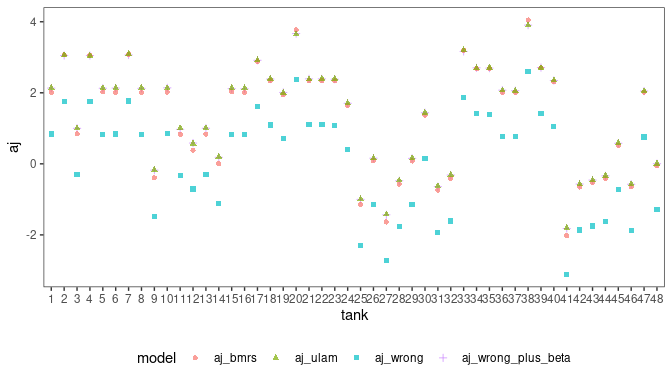

Week 6 HW
================

``` r
library(tidyverse)
library(ggplot2)
library(gridExtra)
library(RColorBrewer)
library(rethinking)
library(scales)
library(dagitty)
library(brms)
library(tidybayes)
library(marginaleffects)

data("reedfrogs")
```

# Ex 1

Conduct a prior predictive simulation for the Reedfrog model. By this I
mean to simulate the prior distribution of tank survival probabilities
$\alpha_j$. Start by using this prior: \$\$
\$\$ Be sure to transform the $\alpha_j$ values to the probability scale
for plotting and summary. How does increasing the width of the prior on
$\sigma$ change the prior distribution of $\alpha_j$? You might try
Exponential(10) and Exponential(0.1) for example.

``` r
N = 100000
sigmas_to_try = round(exp(seq(from=-log(10), to=log(10), by=0.4)),2) #a range of sigma values

#simulate 10k observations of a_j for each sigma
aj_matrix = sapply(sigmas_to_try, function (exp_rate) {
  sigma = rexp(N, exp_rate)
  a_bar = rnorm(N, 0, 1)
  a_j = rnorm(N, a_bar, sigma)  
  a_j
})

colnames(aj_matrix) = sigmas_to_try

aj_matrix |> 
  as_tibble() |> 
  pivot_longer(everything(), names_to = "sigma", values_to = "a_j") |>
  mutate(p = inv_logit(a_j)) |>
  mutate(sigma = paste("σ =", sigma)) |>
  ggplot() + geom_density(aes(x=p)) + 
  facet_wrap(~sigma, nrow=2) + theme_bw() + 
  theme(legend.position = "none") +
  scale_x_continuous(breaks=c(0,0.5, 1))
```

<!-- -->

# Ex 2

Revisit the Reedfrog survival data, data(reedfrogs). Start with the
varying effects model from the book and lecture. Then modify it to
estimate the causal effects of the treatment variables pred and size,
including how size might modify the effect of predation. An easy
approach is to estimate an effect for each combination of pred and size.
Justify your model with a DAG of this experiment.

``` r
dag = dagitty("dag {
    Size -> Survival;
    Predators -> Survival;
    Density -> Survival;
    Tank -> Survival;
}", layout=T)

outcomes(dag) = "Survival"
exposures(dag) = c("Predators", "Size")

plot(dag)
```

<!-- -->

First, replicate the lecture model in BRMS

``` r
mST <- ulam(
  alist(
    surv ~ dbinom(density, p),
    logit(p) <- a[tank] ,
    a[tank] ~ dnorm( a_bar, sigma),
    a_bar ~ dnorm(0, 1.5),
    sigma ~ dexp(1)
  ), 
  data=reedfrogs |> mutate(tank = as.factor(row_number())), 
  chains=4)
```

    ## Warning in '/tmp/RtmpqsYUsE/model-f937cfa9107.stan', line 3, column 4: Declaration
    ##     of arrays by placing brackets after a variable name is deprecated and
    ##     will be removed in Stan 2.32.0. Instead use the array keyword before the
    ##     type. This can be changed automatically using the auto-format flag to
    ##     stanc
    ## Warning in '/tmp/RtmpqsYUsE/model-f937cfa9107.stan', line 4, column 4: Declaration
    ##     of arrays by placing brackets after a variable name is deprecated and
    ##     will be removed in Stan 2.32.0. Instead use the array keyword before the
    ##     type. This can be changed automatically using the auto-format flag to
    ##     stanc
    ## Warning in '/tmp/RtmpqsYUsE/model-f937cfa9107.stan', line 5, column 4: Declaration
    ##     of arrays by placing brackets after a variable name is deprecated and
    ##     will be removed in Stan 2.32.0. Instead use the array keyword before the
    ##     type. This can be changed automatically using the auto-format flag to
    ##     stanc
    ## Warning in '/tmp/RtmpqsYUsE/model-f937cfa9107.stan', line 6, column 4: Declaration
    ##     of arrays by placing brackets after a variable name is deprecated and
    ##     will be removed in Stan 2.32.0. Instead use the array keyword before the
    ##     type. This can be changed automatically using the auto-format flag to
    ##     stanc
    ## Warning in '/tmp/RtmpqsYUsE/model-f937cfa9107.stan', line 7, column 4: Declaration
    ##     of arrays by placing brackets after a variable name is deprecated and
    ##     will be removed in Stan 2.32.0. Instead use the array keyword before the
    ##     type. This can be changed automatically using the auto-format flag to
    ##     stanc

    ## Running MCMC with 4 sequential chains, with 1 thread(s) per chain...
    ## 
    ## Chain 1 Iteration:   1 / 1000 [  0%]  (Warmup) 
    ## Chain 1 Iteration: 100 / 1000 [ 10%]  (Warmup) 
    ## Chain 1 Iteration: 200 / 1000 [ 20%]  (Warmup) 
    ## Chain 1 Iteration: 300 / 1000 [ 30%]  (Warmup) 
    ## Chain 1 Iteration: 400 / 1000 [ 40%]  (Warmup) 
    ## Chain 1 Iteration: 500 / 1000 [ 50%]  (Warmup) 
    ## Chain 1 Iteration: 501 / 1000 [ 50%]  (Sampling) 
    ## Chain 1 Iteration: 600 / 1000 [ 60%]  (Sampling) 
    ## Chain 1 Iteration: 700 / 1000 [ 70%]  (Sampling) 
    ## Chain 1 Iteration: 800 / 1000 [ 80%]  (Sampling) 
    ## Chain 1 Iteration: 900 / 1000 [ 90%]  (Sampling) 
    ## Chain 1 Iteration: 1000 / 1000 [100%]  (Sampling) 
    ## Chain 1 finished in 0.1 seconds.
    ## Chain 2 Iteration:   1 / 1000 [  0%]  (Warmup) 
    ## Chain 2 Iteration: 100 / 1000 [ 10%]  (Warmup) 
    ## Chain 2 Iteration: 200 / 1000 [ 20%]  (Warmup) 
    ## Chain 2 Iteration: 300 / 1000 [ 30%]  (Warmup) 
    ## Chain 2 Iteration: 400 / 1000 [ 40%]  (Warmup) 
    ## Chain 2 Iteration: 500 / 1000 [ 50%]  (Warmup) 
    ## Chain 2 Iteration: 501 / 1000 [ 50%]  (Sampling) 
    ## Chain 2 Iteration: 600 / 1000 [ 60%]  (Sampling) 
    ## Chain 2 Iteration: 700 / 1000 [ 70%]  (Sampling) 
    ## Chain 2 Iteration: 800 / 1000 [ 80%]  (Sampling) 
    ## Chain 2 Iteration: 900 / 1000 [ 90%]  (Sampling) 
    ## Chain 2 Iteration: 1000 / 1000 [100%]  (Sampling)

    ## Chain 2 Informational Message: The current Metropolis proposal is about to be rejected because of the following issue:

    ## Chain 2 Exception: normal_lpdf: Scale parameter is 0, but must be positive! (in '/tmp/RtmpqsYUsE/model-f937cfa9107.stan', line 18, column 4 to column 32)

    ## Chain 2 If this warning occurs sporadically, such as for highly constrained variable types like covariance matrices, then the sampler is fine,

    ## Chain 2 but if this warning occurs often then your model may be either severely ill-conditioned or misspecified.

    ## Chain 2

    ## Chain 2 finished in 0.1 seconds.
    ## Chain 3 Iteration:   1 / 1000 [  0%]  (Warmup) 
    ## Chain 3 Iteration: 100 / 1000 [ 10%]  (Warmup) 
    ## Chain 3 Iteration: 200 / 1000 [ 20%]  (Warmup) 
    ## Chain 3 Iteration: 300 / 1000 [ 30%]  (Warmup) 
    ## Chain 3 Iteration: 400 / 1000 [ 40%]  (Warmup) 
    ## Chain 3 Iteration: 500 / 1000 [ 50%]  (Warmup) 
    ## Chain 3 Iteration: 501 / 1000 [ 50%]  (Sampling) 
    ## Chain 3 Iteration: 600 / 1000 [ 60%]  (Sampling) 
    ## Chain 3 Iteration: 700 / 1000 [ 70%]  (Sampling) 
    ## Chain 3 Iteration: 800 / 1000 [ 80%]  (Sampling) 
    ## Chain 3 Iteration: 900 / 1000 [ 90%]  (Sampling) 
    ## Chain 3 Iteration: 1000 / 1000 [100%]  (Sampling) 
    ## Chain 3 finished in 0.1 seconds.
    ## Chain 4 Iteration:   1 / 1000 [  0%]  (Warmup) 
    ## Chain 4 Iteration: 100 / 1000 [ 10%]  (Warmup) 
    ## Chain 4 Iteration: 200 / 1000 [ 20%]  (Warmup) 
    ## Chain 4 Iteration: 300 / 1000 [ 30%]  (Warmup) 
    ## Chain 4 Iteration: 400 / 1000 [ 40%]  (Warmup) 
    ## Chain 4 Iteration: 500 / 1000 [ 50%]  (Warmup) 
    ## Chain 4 Iteration: 501 / 1000 [ 50%]  (Sampling) 
    ## Chain 4 Iteration: 600 / 1000 [ 60%]  (Sampling) 
    ## Chain 4 Iteration: 700 / 1000 [ 70%]  (Sampling) 
    ## Chain 4 Iteration: 800 / 1000 [ 80%]  (Sampling) 
    ## Chain 4 Iteration: 900 / 1000 [ 90%]  (Sampling) 
    ## Chain 4 Iteration: 1000 / 1000 [100%]  (Sampling) 
    ## Chain 4 finished in 0.1 seconds.
    ## 
    ## All 4 chains finished successfully.
    ## Mean chain execution time: 0.1 seconds.
    ## Total execution time: 0.5 seconds.

In BRMS, it does not seem it is possible to do a basic centered
parameterization, it has built-in non-centered parameterization.. So the
best I can do is to make $\sigma$ to be the same, but these models won’t
be fully equivalent.

``` r
replicated_model = brm(
  formula = surv | trials(density) ~ 0 + (1 | tank),
  data = reedfrogs |> mutate(tank = as.factor(row_number())), 
  family=binomial,
  prior = c(
    prior(exponential(1), class = sd, group = tank)
  ),
  refresh= 0, 
  silent = 2
)
```

    ## Running /usr/lib/R/bin/R CMD SHLIB foo.c
    ## gcc -I"/usr/share/R/include" -DNDEBUG   -I"/home/aurimas/R/x86_64-pc-linux-gnu-library/4.2/Rcpp/include/"  -I"/home/aurimas/R/x86_64-pc-linux-gnu-library/4.2/RcppEigen/include/"  -I"/home/aurimas/R/x86_64-pc-linux-gnu-library/4.2/RcppEigen/include/unsupported"  -I"/home/aurimas/R/x86_64-pc-linux-gnu-library/4.2/BH/include" -I"/home/aurimas/R/x86_64-pc-linux-gnu-library/4.2/StanHeaders/include/src/"  -I"/home/aurimas/R/x86_64-pc-linux-gnu-library/4.2/StanHeaders/include/"  -I"/home/aurimas/R/x86_64-pc-linux-gnu-library/4.2/RcppParallel/include/"  -I"/home/aurimas/R/x86_64-pc-linux-gnu-library/4.2/rstan/include" -DEIGEN_NO_DEBUG  -DBOOST_DISABLE_ASSERTS  -DBOOST_PENDING_INTEGER_LOG2_HPP  -DSTAN_THREADS  -DBOOST_NO_AUTO_PTR  -include '/home/aurimas/R/x86_64-pc-linux-gnu-library/4.2/StanHeaders/include/stan/math/prim/mat/fun/Eigen.hpp'  -D_REENTRANT -DRCPP_PARALLEL_USE_TBB=1      -fpic  -g -O2 -fdebug-prefix-map=/build/r-base-a3XuZ5/r-base-4.2.2.20221110=. -fstack-protector-strong -Wformat -Werror=format-security -Wdate-time -D_FORTIFY_SOURCE=2  -c foo.c -o foo.o
    ## In file included from /home/aurimas/R/x86_64-pc-linux-gnu-library/4.2/RcppEigen/include/Eigen/Core:88,
    ##                  from /home/aurimas/R/x86_64-pc-linux-gnu-library/4.2/RcppEigen/include/Eigen/Dense:1,
    ##                  from /home/aurimas/R/x86_64-pc-linux-gnu-library/4.2/StanHeaders/include/stan/math/prim/mat/fun/Eigen.hpp:13,
    ##                  from <command-line>:
    ## /home/aurimas/R/x86_64-pc-linux-gnu-library/4.2/RcppEigen/include/Eigen/src/Core/util/Macros.h:628:1: error: unknown type name ‘namespace’
    ##   628 | namespace Eigen {
    ##       | ^~~~~~~~~
    ## /home/aurimas/R/x86_64-pc-linux-gnu-library/4.2/RcppEigen/include/Eigen/src/Core/util/Macros.h:628:17: error: expected ‘=’, ‘,’, ‘;’, ‘asm’ or ‘__attribute__’ before ‘{’ token
    ##   628 | namespace Eigen {
    ##       |                 ^
    ## In file included from /home/aurimas/R/x86_64-pc-linux-gnu-library/4.2/RcppEigen/include/Eigen/Dense:1,
    ##                  from /home/aurimas/R/x86_64-pc-linux-gnu-library/4.2/StanHeaders/include/stan/math/prim/mat/fun/Eigen.hpp:13,
    ##                  from <command-line>:
    ## /home/aurimas/R/x86_64-pc-linux-gnu-library/4.2/RcppEigen/include/Eigen/Core:96:10: fatal error: complex: No such file or directory
    ##    96 | #include <complex>
    ##       |          ^~~~~~~~~
    ## compilation terminated.
    ## make: *** [/usr/lib/R/etc/Makeconf:169: foo.o] Error 1

Note: a lot of BRMS examples use formula equivalent to
`surv | trials(density) ~ 1 + (1 | tank)`. But that’s not what the model
is. This translates to a model with an additional intercept:

$$
\begin{aligned}
S \sim & \operatorname{Binomial}(D, p) \\
\operatorname{logit}(p) & = \beta + \alpha_j \\
\alpha_j & \sim \operatorname{Normal}(\bar{\alpha}, \sigma) \\
\bar{\alpha} & \sim \operatorname{Normal}(0,1) \\
\beta & \sim \operatorname{Normal}(0,1) \\
\sigma & \sim \operatorname{Exponential}(1)
\end{aligned}
$$

    ## Running /usr/lib/R/bin/R CMD SHLIB foo.c
    ## gcc -I"/usr/share/R/include" -DNDEBUG   -I"/home/aurimas/R/x86_64-pc-linux-gnu-library/4.2/Rcpp/include/"  -I"/home/aurimas/R/x86_64-pc-linux-gnu-library/4.2/RcppEigen/include/"  -I"/home/aurimas/R/x86_64-pc-linux-gnu-library/4.2/RcppEigen/include/unsupported"  -I"/home/aurimas/R/x86_64-pc-linux-gnu-library/4.2/BH/include" -I"/home/aurimas/R/x86_64-pc-linux-gnu-library/4.2/StanHeaders/include/src/"  -I"/home/aurimas/R/x86_64-pc-linux-gnu-library/4.2/StanHeaders/include/"  -I"/home/aurimas/R/x86_64-pc-linux-gnu-library/4.2/RcppParallel/include/"  -I"/home/aurimas/R/x86_64-pc-linux-gnu-library/4.2/rstan/include" -DEIGEN_NO_DEBUG  -DBOOST_DISABLE_ASSERTS  -DBOOST_PENDING_INTEGER_LOG2_HPP  -DSTAN_THREADS  -DBOOST_NO_AUTO_PTR  -include '/home/aurimas/R/x86_64-pc-linux-gnu-library/4.2/StanHeaders/include/stan/math/prim/mat/fun/Eigen.hpp'  -D_REENTRANT -DRCPP_PARALLEL_USE_TBB=1      -fpic  -g -O2 -fdebug-prefix-map=/build/r-base-a3XuZ5/r-base-4.2.2.20221110=. -fstack-protector-strong -Wformat -Werror=format-security -Wdate-time -D_FORTIFY_SOURCE=2  -c foo.c -o foo.o
    ## In file included from /home/aurimas/R/x86_64-pc-linux-gnu-library/4.2/RcppEigen/include/Eigen/Core:88,
    ##                  from /home/aurimas/R/x86_64-pc-linux-gnu-library/4.2/RcppEigen/include/Eigen/Dense:1,
    ##                  from /home/aurimas/R/x86_64-pc-linux-gnu-library/4.2/StanHeaders/include/stan/math/prim/mat/fun/Eigen.hpp:13,
    ##                  from <command-line>:
    ## /home/aurimas/R/x86_64-pc-linux-gnu-library/4.2/RcppEigen/include/Eigen/src/Core/util/Macros.h:628:1: error: unknown type name ‘namespace’
    ##   628 | namespace Eigen {
    ##       | ^~~~~~~~~
    ## /home/aurimas/R/x86_64-pc-linux-gnu-library/4.2/RcppEigen/include/Eigen/src/Core/util/Macros.h:628:17: error: expected ‘=’, ‘,’, ‘;’, ‘asm’ or ‘__attribute__’ before ‘{’ token
    ##   628 | namespace Eigen {
    ##       |                 ^
    ## In file included from /home/aurimas/R/x86_64-pc-linux-gnu-library/4.2/RcppEigen/include/Eigen/Dense:1,
    ##                  from /home/aurimas/R/x86_64-pc-linux-gnu-library/4.2/StanHeaders/include/stan/math/prim/mat/fun/Eigen.hpp:13,
    ##                  from <command-line>:
    ## /home/aurimas/R/x86_64-pc-linux-gnu-library/4.2/RcppEigen/include/Eigen/Core:96:10: fatal error: complex: No such file or directory
    ##    96 | #include <complex>
    ##       |          ^~~~~~~~~
    ## compilation terminated.
    ## make: *** [/usr/lib/R/etc/Makeconf:169: foo.o] Error 1

We can see that in the estimates for $\alpha_j$ produced by the three
models. The blue dots are offset - approximately by the $\beta$
parameter (\~1.3). Interestingly, adding the beta, we get closer to ULAM
estimates, and not the BRMS intercept-free estimates.

``` r
beta = fixef(replicated_model_wrong)[1]

tibble(
  tank = as.factor(1:48),
  aj_wrong = ranef(replicated_model_wrong)$tank[1:48],
  aj_wrong_plus_beta = ranef(replicated_model_wrong)$tank[1:48] + beta,
  aj_bmrs = ranef(replicated_model)$tank[1:48],
  aj_ulam = precis(mST, depth=2)[1:48,1]
) |> pivot_longer(-c(tank), names_to="model", values_to="aj") |>
  ggplot() + 
  geom_point(aes(x=tank, y=aj, color=model, shape=model), alpha=0.7) +
  theme_bw() + theme(
    legend.position = "bottom", 
    panel.grid.major = element_blank(), 
    panel.grid.minor = element_blank()
  )
```

<!-- -->

It’s also interesting that brms does not save the population parameter
($\bar{\alpha}$) at all.. we can peek at generated STAN code - it has
$z_1$ parameters (that’s the standardized effects, a.k.a. Z-scores), but
what about `r_1_1`? Are they saved?

``` r
cat(replicated_model$model)
```

    ## // generated with brms 2.18.0
    ## functions {
    ## }
    ## data {
    ##   int<lower=1> N;  // total number of observations
    ##   int Y[N];  // response variable
    ##   int trials[N];  // number of trials
    ##   // data for group-level effects of ID 1
    ##   int<lower=1> N_1;  // number of grouping levels
    ##   int<lower=1> M_1;  // number of coefficients per level
    ##   int<lower=1> J_1[N];  // grouping indicator per observation
    ##   // group-level predictor values
    ##   vector[N] Z_1_1;
    ##   int prior_only;  // should the likelihood be ignored?
    ## }
    ## transformed data {
    ## }
    ## parameters {
    ##   vector<lower=0>[M_1] sd_1;  // group-level standard deviations
    ##   vector[N_1] z_1[M_1];  // standardized group-level effects
    ## }
    ## transformed parameters {
    ##   vector[N_1] r_1_1;  // actual group-level effects
    ##   real lprior = 0;  // prior contributions to the log posterior
    ##   r_1_1 = (sd_1[1] * (z_1[1]));
    ##   lprior += exponential_lpdf(sd_1 | 1);
    ## }
    ## model {
    ##   // likelihood including constants
    ##   if (!prior_only) {
    ##     // initialize linear predictor term
    ##     vector[N] mu = rep_vector(0.0, N);
    ##     for (n in 1:N) {
    ##       // add more terms to the linear predictor
    ##       mu[n] += r_1_1[J_1[n]] * Z_1_1[n];
    ##     }
    ##     target += binomial_logit_lpmf(Y | trials, mu);
    ##   }
    ##   // priors including constants
    ##   target += lprior;
    ##   target += std_normal_lpdf(z_1[1]);
    ## }
    ## generated quantities {
    ## }

Let’s do a non-centered parameterization with ulam and compare:

``` r
mST_non_centered <- ulam(
  alist(
    surv ~ dbinom(density, p),
    logit(p) <- a[tank],
    save> vector[48]:a <<- a_bar + za * sigma,
    vector[48]:za ~ dnorm(0, 1),
    a_bar ~ dnorm(0, 1.5),
    sigma ~ dexp(1)
  ), 
  data=reedfrogs |> mutate(tank = as.factor(row_number())), 
  chains=4, iter=2000)
```

    ## Running MCMC with 4 sequential chains, with 1 thread(s) per chain...
    ## 
    ## Chain 1 Iteration:    1 / 2000 [  0%]  (Warmup) 
    ## Chain 1 Iteration:  100 / 2000 [  5%]  (Warmup) 
    ## Chain 1 Iteration:  200 / 2000 [ 10%]  (Warmup) 
    ## Chain 1 Iteration:  300 / 2000 [ 15%]  (Warmup) 
    ## Chain 1 Iteration:  400 / 2000 [ 20%]  (Warmup) 
    ## Chain 1 Iteration:  500 / 2000 [ 25%]  (Warmup) 
    ## Chain 1 Iteration:  600 / 2000 [ 30%]  (Warmup) 
    ## Chain 1 Iteration:  700 / 2000 [ 35%]  (Warmup) 
    ## Chain 1 Iteration:  800 / 2000 [ 40%]  (Warmup) 
    ## Chain 1 Iteration:  900 / 2000 [ 45%]  (Warmup) 
    ## Chain 1 Iteration: 1000 / 2000 [ 50%]  (Warmup) 
    ## Chain 1 Iteration: 1001 / 2000 [ 50%]  (Sampling) 
    ## Chain 1 Iteration: 1100 / 2000 [ 55%]  (Sampling) 
    ## Chain 1 Iteration: 1200 / 2000 [ 60%]  (Sampling) 
    ## Chain 1 Iteration: 1300 / 2000 [ 65%]  (Sampling) 
    ## Chain 1 Iteration: 1400 / 2000 [ 70%]  (Sampling) 
    ## Chain 1 Iteration: 1500 / 2000 [ 75%]  (Sampling) 
    ## Chain 1 Iteration: 1600 / 2000 [ 80%]  (Sampling) 
    ## Chain 1 Iteration: 1700 / 2000 [ 85%]  (Sampling) 
    ## Chain 1 Iteration: 1800 / 2000 [ 90%]  (Sampling) 
    ## Chain 1 Iteration: 1900 / 2000 [ 95%]  (Sampling) 
    ## Chain 1 Iteration: 2000 / 2000 [100%]  (Sampling) 
    ## Chain 1 finished in 0.3 seconds.
    ## Chain 2 Iteration:    1 / 2000 [  0%]  (Warmup) 
    ## Chain 2 Iteration:  100 / 2000 [  5%]  (Warmup) 
    ## Chain 2 Iteration:  200 / 2000 [ 10%]  (Warmup) 
    ## Chain 2 Iteration:  300 / 2000 [ 15%]  (Warmup) 
    ## Chain 2 Iteration:  400 / 2000 [ 20%]  (Warmup) 
    ## Chain 2 Iteration:  500 / 2000 [ 25%]  (Warmup) 
    ## Chain 2 Iteration:  600 / 2000 [ 30%]  (Warmup) 
    ## Chain 2 Iteration:  700 / 2000 [ 35%]  (Warmup) 
    ## Chain 2 Iteration:  800 / 2000 [ 40%]  (Warmup) 
    ## Chain 2 Iteration:  900 / 2000 [ 45%]  (Warmup) 
    ## Chain 2 Iteration: 1000 / 2000 [ 50%]  (Warmup) 
    ## Chain 2 Iteration: 1001 / 2000 [ 50%]  (Sampling) 
    ## Chain 2 Iteration: 1100 / 2000 [ 55%]  (Sampling) 
    ## Chain 2 Iteration: 1200 / 2000 [ 60%]  (Sampling) 
    ## Chain 2 Iteration: 1300 / 2000 [ 65%]  (Sampling) 
    ## Chain 2 Iteration: 1400 / 2000 [ 70%]  (Sampling) 
    ## Chain 2 Iteration: 1500 / 2000 [ 75%]  (Sampling) 
    ## Chain 2 Iteration: 1600 / 2000 [ 80%]  (Sampling) 
    ## Chain 2 Iteration: 1700 / 2000 [ 85%]  (Sampling) 
    ## Chain 2 Iteration: 1800 / 2000 [ 90%]  (Sampling) 
    ## Chain 2 Iteration: 1900 / 2000 [ 95%]  (Sampling) 
    ## Chain 2 Iteration: 2000 / 2000 [100%]  (Sampling) 
    ## Chain 2 finished in 0.2 seconds.
    ## Chain 3 Iteration:    1 / 2000 [  0%]  (Warmup) 
    ## Chain 3 Iteration:  100 / 2000 [  5%]  (Warmup) 
    ## Chain 3 Iteration:  200 / 2000 [ 10%]  (Warmup) 
    ## Chain 3 Iteration:  300 / 2000 [ 15%]  (Warmup) 
    ## Chain 3 Iteration:  400 / 2000 [ 20%]  (Warmup) 
    ## Chain 3 Iteration:  500 / 2000 [ 25%]  (Warmup) 
    ## Chain 3 Iteration:  600 / 2000 [ 30%]  (Warmup) 
    ## Chain 3 Iteration:  700 / 2000 [ 35%]  (Warmup) 
    ## Chain 3 Iteration:  800 / 2000 [ 40%]  (Warmup) 
    ## Chain 3 Iteration:  900 / 2000 [ 45%]  (Warmup) 
    ## Chain 3 Iteration: 1000 / 2000 [ 50%]  (Warmup) 
    ## Chain 3 Iteration: 1001 / 2000 [ 50%]  (Sampling) 
    ## Chain 3 Iteration: 1100 / 2000 [ 55%]  (Sampling) 
    ## Chain 3 Iteration: 1200 / 2000 [ 60%]  (Sampling) 
    ## Chain 3 Iteration: 1300 / 2000 [ 65%]  (Sampling) 
    ## Chain 3 Iteration: 1400 / 2000 [ 70%]  (Sampling) 
    ## Chain 3 Iteration: 1500 / 2000 [ 75%]  (Sampling) 
    ## Chain 3 Iteration: 1600 / 2000 [ 80%]  (Sampling) 
    ## Chain 3 Iteration: 1700 / 2000 [ 85%]  (Sampling) 
    ## Chain 3 Iteration: 1800 / 2000 [ 90%]  (Sampling) 
    ## Chain 3 Iteration: 1900 / 2000 [ 95%]  (Sampling) 
    ## Chain 3 Iteration: 2000 / 2000 [100%]  (Sampling) 
    ## Chain 3 finished in 0.3 seconds.
    ## Chain 4 Iteration:    1 / 2000 [  0%]  (Warmup) 
    ## Chain 4 Iteration:  100 / 2000 [  5%]  (Warmup) 
    ## Chain 4 Iteration:  200 / 2000 [ 10%]  (Warmup) 
    ## Chain 4 Iteration:  300 / 2000 [ 15%]  (Warmup) 
    ## Chain 4 Iteration:  400 / 2000 [ 20%]  (Warmup) 
    ## Chain 4 Iteration:  500 / 2000 [ 25%]  (Warmup) 
    ## Chain 4 Iteration:  600 / 2000 [ 30%]  (Warmup) 
    ## Chain 4 Iteration:  700 / 2000 [ 35%]  (Warmup) 
    ## Chain 4 Iteration:  800 / 2000 [ 40%]  (Warmup) 
    ## Chain 4 Iteration:  900 / 2000 [ 45%]  (Warmup) 
    ## Chain 4 Iteration: 1000 / 2000 [ 50%]  (Warmup) 
    ## Chain 4 Iteration: 1001 / 2000 [ 50%]  (Sampling) 
    ## Chain 4 Iteration: 1100 / 2000 [ 55%]  (Sampling) 
    ## Chain 4 Iteration: 1200 / 2000 [ 60%]  (Sampling) 
    ## Chain 4 Iteration: 1300 / 2000 [ 65%]  (Sampling) 
    ## Chain 4 Iteration: 1400 / 2000 [ 70%]  (Sampling) 
    ## Chain 4 Iteration: 1500 / 2000 [ 75%]  (Sampling) 
    ## Chain 4 Iteration: 1600 / 2000 [ 80%]  (Sampling) 
    ## Chain 4 Iteration: 1700 / 2000 [ 85%]  (Sampling) 
    ## Chain 4 Iteration: 1800 / 2000 [ 90%]  (Sampling) 
    ## Chain 4 Iteration: 1900 / 2000 [ 95%]  (Sampling) 
    ## Chain 4 Iteration: 2000 / 2000 [100%]  (Sampling) 
    ## Chain 4 finished in 0.2 seconds.
    ## 
    ## All 4 chains finished successfully.
    ## Mean chain execution time: 0.2 seconds.
    ## Total execution time: 1.3 seconds.

``` r
cat(mST_non_centered@model)
```

    ## data{
    ##     vector[48] propsurv;
    ##     int size[48];
    ##     int pred[48];
    ##     int density[48];
    ##     int surv[48];
    ##     int tank[48];
    ## }
    ## parameters{
    ##     vector[48] za;
    ##     real a_bar;
    ##     real<lower=0> sigma;
    ## }
    ## model{
    ##     vector[48] p;
    ##     vector[48] a;
    ##     sigma ~ exponential( 1 );
    ##     a_bar ~ normal( 0 , 1.5 );
    ##     za ~ normal( 0 , 1 );
    ##     a = a_bar + za * sigma;
    ##     for ( i in 1:48 ) {
    ##         p[i] = a[tank[i]];
    ##         p[i] = inv_logit(p[i]);
    ##     }
    ##     surv ~ binomial( density , p );
    ## }
    ## generated quantities{
    ##     vector[48] a;
    ##     a = a_bar + za * sigma;
    ## }

Looks like BRMS reports the non-standardized a (below is the plot of the
distribution of the a\[1\]). That makes sense, given this is the
parameter of interest, but the implementation of that is weird..

``` r
za = extract.samples(mST_non_centered)$za[,1]
a = extract.samples(mST_non_centered)$a[,1]

brms_a = ranef(replicated_model, summary=F)$tank[,1,1]

dt = tibble(za = za, a=a, brms = brms_a) 

ggplot(dt) +
  geom_density(aes(x=za, color="ULAM z_a")) +
  geom_density(aes(x=a, color="ULAM a")) +
  geom_density(aes(x=brms, color="BRMS ?")) +
  xlab("parameter")
```

<!-- -->

## Fitting a model for size & predator causal effects
